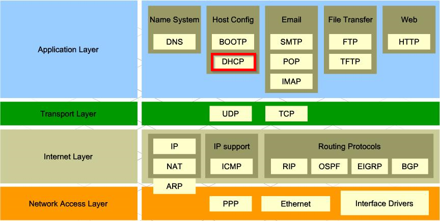
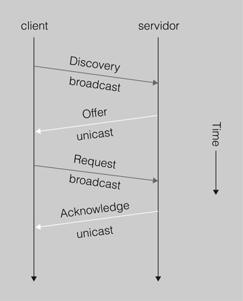
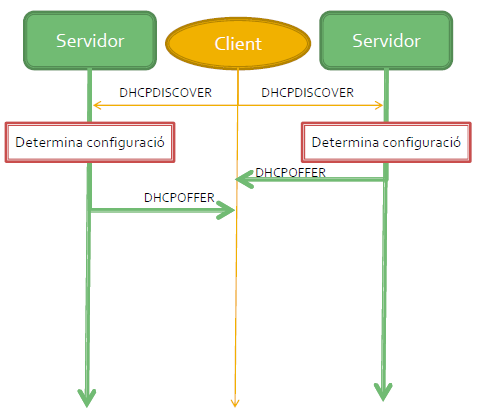
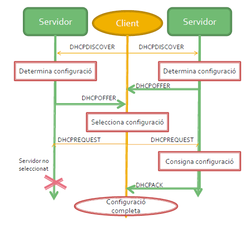
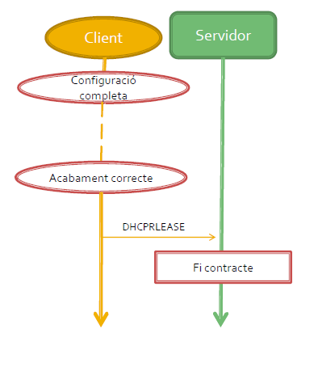

= Protocol DHCP
:encoding: utf-8
:doctype: article
:lang: ca
:toc: left
:numbered:
:teacher:

<<<

== Introducció

* DHCP és l’acrònim de _dynamic host configuration protocol_, en català,
protocol de configuració dinàmica d’equips.
* El servei DHCP és un servei *client-servidor* que permet la configuració
d’adreces IP, màscares, passarel·les per defecte i moltes altres opcions de
configuració de manera totalment dinàmica.
* Es tracta d'un protocol de la capa d'*Aplicació* del model TCP/IP .

== El servei DHCP

* El servei DHCP proporciona un mecanisme de configuració centralitzat dels
equips de la xarxa.
* En lloc de configurar un per un els equips de xarxa amb adreces i valors
estàtics, un *servidor DHCP* anirà assignant als equips clients els valors que
els corresponguin.
* Aquesta assignació es fa per un període de temps finit, passat el qual caldrà
renovar-se.

* El *servei DHCP* té diversos avantatges:
** Evita errors i conflictes IP.
** Centralitza l’administració.
** Estalvia temps.
** Simplifica l’administració.

* L'*assignació manual* d'IP té diversos avantatges:
** Permet que la identificació a Internet de l'equip no varii i la IP
identifiqui el node.
** Configuració simple.
** Tenir control sobre les adreces IP de la xarxa facilita l'implantació de
millores de seguretat.

== Necesitats dels clients

* Tot equip de xarxa necessita disposar d’una adreça IP que l’identifica de
manera única a la xarxa.
* Cal també una màscara per poder separar de l’adreça IP quina és la part
d’adreça de xarxa i quina la part d’adreça de host.
* Finalment, és imprescindible disposar de l’adreça de la porta d’enllaç
predeterminada o passarel·la per defecte (o gateway), per disposar d’accés a
xarxes externes.
* A part de la configuració bàsica, els equips poden necessitar més paràmetres
de configuració com, per exemple: el nom del host, el servidor DNS, el fitxer
d’iniciació, etc.

== Assignació de la configuració de xarxa dels equips

* Els equips poden obtenir la seva configuració de xarxa de diferents maneres:
** Manualment per mitjà de l'administrador de xarxa.
*** Diem que la configuració IP és *estàtica*.
** Dinàmicament
*** Configuració «stateless» (Només IPv6)
*** Configuració «stateless» + DHCP (Només IPv6)
*** Configuració DHCP (IPv4 i IPv6)
**** Assignació *dinàmica d'interval*.
**** Assignació *fixa*

=== Assignació dinàmica d'interval

* El servidor DHCP disposa d’un interval d’adreces que pot assignar als clients
que demanen una adreça IP.
* Quan el servidor assigna una adreça qualsevol de l’interval al client (a
  l’atzar) es tracta d’una assignació dinàmica d’interval.
* El client no sap quina adreça IP tindrà i no hi ha manera de predir quina
adreça se li concedirà en una futura configuració.
* A cada nova assignació l’adreça IP pot ser diferent.

=== Assignació fixa

* Una assignació fixa es produeix quan el servidor DHCP sempre assigna la
mateixa adreça al client.
* Per assignar sempre la mateixa adreça IP al client cal que el servidor pugui
identificar inequívocament el client (per l’adreça MAC).
* El servidor disposa d’una taula amb les correspondències entre les adreces
MAC i les adreces IP fixes.

== Evolució

* La configuració dinàmica d’equips de xarxa es va iniciar amb el protocol
BOOTP (_BOOT Strap Protocol_ o protocol d’arrencada).
* Era un protocol més bàsic que principalment permetia definir l’adreça IP,
la màscara de xarxa i la passarel·la per defecte per al client. El BOOTP
(RFC 951, any 1985) és un protocol pensat per proporcionar automàticament la
IP a clients de xarxa en el procés d’arrencada.
* Originàriament s’utilitzava per a estacions de treball sense disc que
obtenien la configuració de xarxa del protocol BOOTP i també obtenien el nom
d’un fitxer d’arrencada que s’havia de baixar per mitjà del TFTP, que
usualment era el sistema operatiu.
* El BOOTP va donar pas al protocol DHCP, que n’és una evolució amb moltes
més prestacions.
* El DHCP sorgeix l’octubre de 1993 mitjançant l’RFC 1531.El DHCP sorgeix
l’octubre de 1993 mitjançant l’RFC 1531.

== Funcionament

* El protocol DHCP descriu el diàleg que es produeix entre client i servidor
per a la concessió de configuracions IP.
* En una xarxa amb configuració d’equips dinàmica, un o més servidors DHCP
escoltaran les peticions dels clients en el *port 67*.
* Els clients DHCP sol·licitaran al servidor DHCP una configuració IP i
començarà un procés de negociació que ha d’acabar (si tot va bé) amb
la concessió d’una adreça IP al client.
* Els servidors parlen al *port 68* dels clients.

[NOTE]
====
El protocol DHCP utilitza UDP en la capa de transport. Utilitza dos ports:

* Port *67*, on escolta el servidor.
* Port *68*, on escolta el client.
====

La negociació que s’estableix es pot definir a grans trets de la manera següent:

. El client sol·licita una adreça IP (de fet, una configuració de xarxa).
. El servidor mira les adreces IP disponibles dins del rang d’adreces
dinàmiques de què disposa per concedir i n’ofereix una al client.
. Si el client l’accepta, envia una sol·licitud al servidor per fer-la seva.
. Si al servidor li sembla bé, accepta la petició del client i li confirma que
pot utilitzar aquesta adreça IP, que l’hi concedeix per un períodede temps
limitat.

[NOTE]
====
La concessió de l’adreça IP és per un període de temps establert pel servidor.

Això significa que, transcorregut aquest període, el client haurà de renegociar
la concessió en un procés similar al descrit anteriorment.
====

== Missatges del protocol DHCP

Els següents són els tipus de paquets DHCP:

* DHCP discover
* DHCP offer
* DHCP request
* DHCP ack / DHCP nack
* DHCP decline
* DHCP release
* DHCP information

.Funcionament del protocol DHCP

=== DHCP Discover

* El paquet *DHCP discover* és el primer que s’envia.
* L’envia el client per tal de demanar una configuració IP a algun servidor.
* El client no sap a quina xarxa pertany (no té adreça IP ni màscara de xarxa)
ni tampoc sap quins servidors DHCP hi ha en la xarxa (si n’hi ha cap). Per tant,
el client genera un paquet de broadcast on sol·licita una configuració IP.
* A la xarxa pot haver-hi cap, un o més d’un servidor DHCP per atendre aquesta
petició.

=== DHCP Offer

* El servidor selecciona una IP disponible i la reserva per al client (encara
no està assignada).
* Tot seguit envia un paquet *DHCP offer* (*unicast* o *broadcast*, RFC 2131)
al client amb tota la informació de configuració requerida.
* L’adreça IP i MAC origen identifiquen el servidor que fa l’oferta. El
destinatari s’indica per la seva adreça MAC (que és coneguda). El camp IP del
destinatari és l’adreça IP que el servidor ofereix (penseu que el client encara
no té IP).
* Un altre concepte important és per quant de temps es realitza la concessió.
* El paquet inclou més camps per completar la resta de configuració de xarxa,
per exemple, la porta d’enllaç per defecte, els servidors DNS,etc.

=== DHCP Request

* Quan el client rep una oferta de configuració IP per part d’un servidor,
la pot acceptar o rebutjar.
* Si el client no accepta l’oferta, simplement realitzarà un DHCP discovery
de nou. Això és suficient perquè el servidor s’adoni que l’oferta ha estat
rebutjada.
* Si el client accepta l’oferta, ho ha de comunicar al servidor.
** El mecanisme per fer-ho és mitjançant un paquet *DHCP request* enviat un
altre cop per *broadcast*.
* A hores d’ara, el client encara no disposa de l’adreça IP per utilitzar-la.
El servidor l’ha reservat, però encara no ha donat el sí definitiu perquè sigui
concedida al client.
* El motiu pel qual el client demana quedar-se la concessió (DHCP request) que
ha rebut utilitzant broadcast és fer públic a tothom de la xarxa que ha
acceptat una oferta d’un servidor DHCP concret.
* Recordeu que la petició del client es fa per difusió i, per tant, pot rebre
ofertes de diferents servidors DHCP. Quan accepta una de les ofertes, no ha de
dir res als altres servidors que ha refusat. Simplement fent pública quina
oferta accepta, la resta de servidors DHCP entenen que laseva oferta s’ha
rebutjat.

=== DHCP ack / DHCP nack

* L’últim pas en una negociació DHCP bàsica el realitza el servidor quan
finalment autoritza la concessió enviant el paquet *DHCPACK*
(_DHCP acknowledgement_), aquest enviament pot ser *unicast* o *broadcast*
(RFC 2131).
* A partir d’aquest moment, el client sí pot fer ús de l’adreça IP i de la
configuració de xarxa rebuda. DHCPACK inclou tota la informació referent a la
durada de la concessió i les dades necessàries per gestionar quan expira.
* El servidor anotarà en el registre de concessions la que acaba de realitzar
i detallarà tots els aspectes d’aquesta, en especial el tempsde concessió. El
paquet d’acceptació de la concessió DHCPACK és un paquet unicast adreçat a la
MAC del client. Recordeu que el client encara no disposa d’una adreça IP
vàlida, en disposarà en rebre el DHCPACK.
* Quan un servidor DHCP detecta que la IP que havia reservat per a un client i
que li anava a concedir ja està en ús, el servidor envia al client un paquet
*DHCPNACK* i indica la no-autorització de la concessió. El client que rep un
DHCPNACK ha de tornar a iniciar tot el procés de negociació començant un altre
cop pel DHCP discovery.

=== DCHP decline

* Per la seva part, el client també pot examinar l’adreça IP oferta pel
servidor per comprovar si està en ús o no.
* Pot fer altres proves per veure si li sembla correcta o no l’oferta rebuda
del servidor. Per exemple, en el cas de renovació d’una IP el client pot rebre
una IP diferent a la que utilitza i no li interessa.
* En aquests casos, el client pot enviar un paquet DHCP decline al servidor
per indicar que la seva oferta ha estat rebutjada.

=== DHCP Release

* Quan un client ja no necessita més l’ús de la configuració IP que ha rebut,
la pot alliberar enviant al servidor un paquet DHCP release.
* En fer-ho, el servidor afegeix l’adreça IP al conjunt d’adreces dinàmiques
que té disponibles. També fa l’anotació pertinent en el registre de concessions
(leases) per indicar que ha finalitzat l’ús de l’adreça.
* De totes maneres, molt sovint el client no pot arribar a emetre aquest paquet
perquè és apagat per l’usuari sense deixar temps al sistema peralliberar la IP.

=== DHCP Information

* En tot moment el client pot sol·licitar més informació sobre la configuració
de xarxa al servidor utilitzant un paquet DHCP information.
* En el paquet DHCP offer que el servidor envia al client, consten les
informacions generals de configuració de xarxa que es trameten en l’oferta:
adreça IP, màscara de xarxa, porta d’enllaç predeterminada,servidor DNS,
fitxer a baixar i molts altres paràmetres que poden estar configurats per
enviar-se en l’oferta.
* El client pot tornar a demanar al servidor la informació d’aquests paràmetres
o pot sol·licitar informació per a la configuració d’altres paràmetres (WINS,
NetBIOS, hostname, etc.).
* El client només pot realitzar una petició d’informació DHCP information al
servidor un cop ja està configurat.

== Petició de renovació/concessió d'una IP concreta

* El procés de quatre fases usuals de DHCP consistent en
discovery/offer/request/ack es produeix quan el client sol·licita una IP de nou.
* Sabem que les concessions són per a un interval de temps. Quan el termini
de concessió està a punt d'expirar cal que el client en demani la renovació.
* El client demana continuar usant la mateixa IP amb un paquet DHCP request,
i el servidor li concedeix o no amb els paquets DHCP ACK/NACK.

== Exemple

