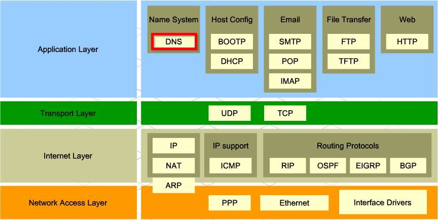
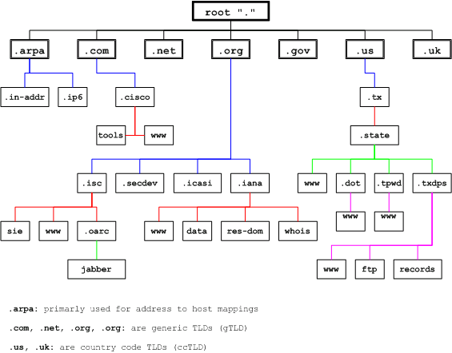
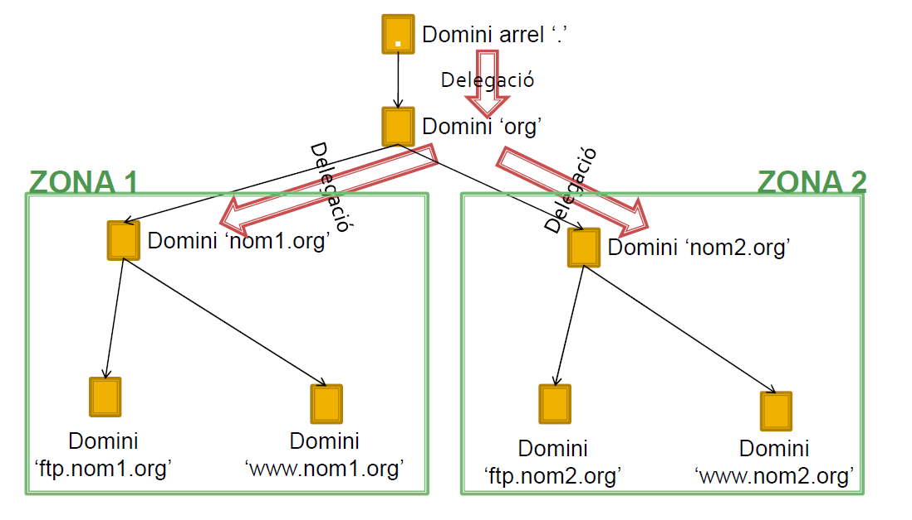
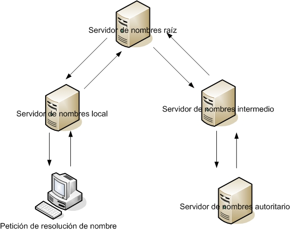
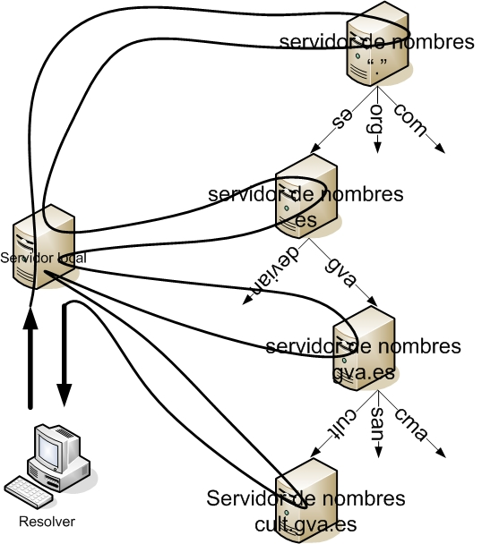
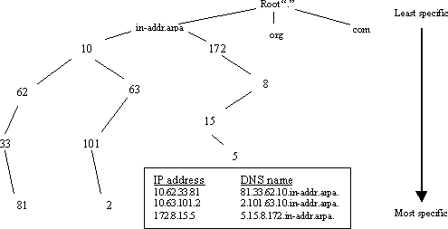

= Servei DNS
:encoding: utf-8
:doctype: article
:lang: ca
:toc: left
:numbered:
:teacher:

<<<

== Protocol DNS

== Resolució de noms

[IMPORTANT]
====
La motivació principal per a la creació d'un **servei de resolució de noms** és
la **dificultat dels usuaris per recordar les adreces de xarxa per fer
referència als diferents hosts** i **Mantenir la independència dels
identificadors a nivell de xarxa (adreces IP) dels identificadors dels rols
dels diferents nodes de la xarxa**.
====

[TIP]
====
* Exemple:
** Enviar un correu a mailto:Lluis@128.111.24.41[Lluis@128.111.24.41]
* Pregunta:
* Què passaria si el ISP del Lluís mou el servidor de correu electrònic a una
màquina diferent?
====

== Serveis de resolució de noms

* Existeixen varis serveis que proporcionen suport a la resolució de noms.
* Alguns d'ells:
** WINS (Windows)
*** net use x:\\servidor\carpeta
** NBP (Name Binding Protocol) (Apple)
** DNS
*** ping servidor.empresa.cat

== Noms de domini

[IMPORTANT]
====
**Definició provisional**

Un nom de domini és:

* el nom que identifica un lloc Web.
* únic a internet.
====

Un servidor Web pot hostatjar llocs Web pertanyents a més d'un domini.

No obstant un domini només pot apuntar a un servidor (llevat de replicació!!),
ja que si al resoldre el nom obtingues més d'una adreça IP no sabria a quina
anar.

== Per a què serveix el servei DNS

* El sistema de noms de domini DNS (domain name system) proporciona un
mecanisme eficaç per fer la resolució de noms de domini a adreces IP.
* El servei DNS no solament permet fer la resolució de noms de domini a
adreces IP, sinó també la **resolució inversa**. És a dir, a partir d’una IP
esbrinar el nom de domini.
* El servei DNS proporciona independència del nom de domini respecte a la IP.
Així un domini pot canviar d’IP de manera transparent per als usuaris del
domini.
* Altres serveis proporcionats pel DNS són la **identificació dels servidors
de correu** d’un domini, de cada un **dels hosts** que pertanyen a la xarxa,
**servidors d’impressió**, etc.

== Sistemes de noms plans i jeràrquics

* El problema d’identificar els equips es produeix des de bon principi de
l’existència de les xarxes d’ordinadors i no és específic de les xarxes TCP/IP.
* En la xarxa inicial ARPANET, els equips ja rebien un nom. Aquests noms es
feien públics per mitjà d’un fitxer centralitzat que contenia els noms de tots
els equips de la xarxa i la seva identificació. Aquest fitxer era el fitxer
_hosts.txt_ (en sistemes GNU/Linux, conegut com a **/etc/hosts**).
* En una xarxa petita es pot generar un fitxer amb el nom i identificador IP
de tots els hosts, centralitzat en un servidor, i encarregar-se de distribuir
còpies d’aquest fitxer a tots els equips de la xarxa.
* Però aquest model no és escalable. Si la xarxa creix és impossible de
mantenir. Utilitzar aquest model significaria que hi ha un equip que
centralitza els noms de tots els hosts d’Internet en un sol fitxer! D’altra
banda, també significaria que aquest fitxer s’ha de repartir entre tots els
equips d’Internet perquè sàpiguen com es diuen els altres equips cada cop que
hi ha una actualització. Evidentment cal una altra solució.

== El servei DNS

[IMPORTANT]
====
El servei DNS defineix:

* Un **espai de noms jeràrquic** per a les maquines i les adreces IP.
* Una **base de dades distribuïda** que conté associacions de noms de domini
amb adreces IP.
* Un **resolver** que permet realitzar consultes a aquest servei. Els resolvers
actuen com a clients del servei.
* Un **protocol** per intercanviar informació de noms.
====

=== Espai de noms DNS

* El 1983 sorgeix el domain name system (DNS).
* El DNS proporciona una manera estàndard tant per anomenar hosts com per a
localitzar-los.
* El DNS es basa en una base de dades de noms de domini **jeràrquica** i
**distribuïda** anomenada l'**espai de noms del DNS**.
** Jeràrquica perquè s’organitza en una estructura d'arbre de fins a 127
nivells (originàriament).
** És una base de dades distribuïda perquè la informació no està tota junta en
un sol repositori central, sinó que la informació es troba repartida per parts
en els servidors DNS d’Internet.

.Espai de noms DNS

* Els **nodes** s’identifiquen per un text (el **nom de domini**)
** El nom de domini no es pot repetir en el mateix nivell, però sí en altres
llocs de l’arbre de l’espai de noms.
* Un **domini** és el node indicat i tota la resta de l’arbre del que penja
aquest node separant cada un dels noms amb un punt (.)
* S’entén per **espai de noms** el conjunt de tots els dominis que formen
l’arbre DNS.
** L’estàndard DNS indica que els noms de domini han de ser de seixanta-quatre
caràcters com a màxim, i només poden incloure caràcters llatins, dígits del 0
al 9 i el guió. Les majúscules i minúscules són indiferents.
* L'arbre DNS té una única **arrel**.
* El nom del node arrel és una **cadena buida**.

* Un domini absolut o **FQDN** ("Fully Qualified Domain Name"") és el nom
format per tots els nodes des del domini fins a l'arrel.
* Com que el nom del node arrel és una cadena buida tots els FQDN acaben en
punt (.).
* Un domini relatiu no inclou tots els noms fins a l'arrel.
* Els dominis que pengen directament del node arrel s'anomenen
**TLD «Top Level Domain»**
* Originalment es volia organitzar els TLD per funcionalitat actualment es
treballa sobretot amb una organització geogràfica.

=== Top Level Domains

* Alguns exemples de TLD:
** Organitzacionals
*** .com, agrupa organitzacions comercials
*** .edu, reuneix organitzacions educatives
*** .net, agrupa a organitzacions dedicades a Internet a a les TI
*** .org, reuneix organitzacions no comercials
*** .gov, agrupa organitzacions governamentals
** Geogràfics
*** S'anomenen segons la codificació establerta a l'estàndard ISO 3166
*** .es, .fr, .de, gb,....
** De resolució inversa
** Aques dominis són especials i s'utilitzen per a proporcionar traducció de IP
a nom.
**** .in-addr.arpa

=== Resum - Elements del sistema de noms de domini

[IMPORTANT]
.El sistema de noms de domini d’Internet DNS utilitza els elements següents:
====
* **Espai de noms DNS**.
** El conjunt de tots els dominis (l’arbre).
* **Domini**
** Text identificatiu d’un domini.
* **FQDN**.
** Fully Qualified Domain Name, començant pel node i acabant en l’arrel.
* **Domini relatiu**
** Nom de domini sense qualificar.
* **Domini arrel**
** Domini del qual deriven tots els altres. S’indica amb un punt o amb la
cadena buida
* **TLD (top level domain)**
** Cadascun dels dominis que pengen directament del node arrel.
====

== Les zones

[IMPORTANT]
====
Una **zona** és part de l’espai de noms de domini gestionada per un (o més)
servidors DNS.
====

* Els servidors que gestionen la zona tenen informació completa sobre la zona
i es diu que tenen **autoritat** respecte a ella.
* Cal tenir present que una zona no és el mateix que un domini.
** Un domini es divideix en subdominis per facilitar-ne l’administració, i
cada part administrada per un (o més) servidor DNS és una zona.

[NOTE]
====
El **domini** és un node i tots els nodes que hi ha per sota i la **zona** és
la part de l’arbre administrada per un servidor de noms de domini concret.
====

[NOTE]
====
Una zona conté la informació completa dels equips que formen el domini
corresponent a la zona i dels equips dels subdominis que no s’hagin delegat.
Aquesta informació s’emmagatzema en la **base de dades de zona**.
====

=== Delegació de  zones

[IMPORTANT]
====
**Delegar** l’administració d’un subdomini consisteix en passar l’autoritat
sobre aquest subdomini a una altra **entitat** (a uns altres servidors DNS).
====

* Aquesta nova **entitat** serà la responsable de l’administració de la zona
delegada.
** Té tota l’autoritat per fer i desfer al seu criteri.
** La zona pare perd el control administratiu de la zona delegada i simplement
apunta als servidors de noms de la zona delegada per obtenir informació quan
la requereix.
* L’estàndard que defineix el DNS estableix que cal configurar **dos o més
servidors autoritaris** per a cada zona anomenats **servidor primari** i
**servidor secundari**.
** El motiu és proporcionar un mecanisme de redundància, robustesa, rendiment
i còpia de seguretat.
** Si el servidor de noms falla i és únic possiblement la xarxa caurà,
serà inoperativa.

[IMPORTANT]
====
Els servidors **primari** i **secundari** són **autoritat**.

* Només el primari té els fitxers de zona.
* El secundari n’obté una còpia per transferència.
====

=== Delegació de zones

.Exemple delegació de zones

=== Resum - Delegació de zones

[IMPORTANT]
====
* Domini i zona no són equivalents (tot i que poden coincidir).
* El **domini** és l’arbre de l’espai de noms.
* La **zona** és la part de l’arbre administrada per un servidor DNS concret.
* La **base de dades de zona** la formen els fitxers que emmagatzemen la
descripció dels equips que pertanyen a la zona.
* La **delegació** consisteix a passar l’**autoritat** de la gestió d’un
subdomini a una altra entitat.
====

== La resolució de noms

[IMPORTANT]
====
La **resolució de noms** és el mecanisme pel qual es tradueixen els noms de
màquines a adreces IP (i al revés).
====

* El mecanisme de resolució de noms DNS consta d’un client o **resolver** que
realitzarà les consultes (o querys) a resoldre a uns servidors DNS.
* Si el servidor disposa de la informació perquè forma part de la base de
dades de la seva zona, emetrà una resposta **autoritativa**.
* Si disposa de la resposta perquè la té emmagatzemada temporalment (en un
procés anomenat cache) també emetrà la resposta però aquest cop de manera
**no autoritativa**.
* Si no té informació del domini buscat, el servidor pot fer a altres servidors
la mateixa consulta en un procés que pot ser **recursiu** o **iteratiu**.
* Sempre existeix un camí per trobar el domini buscat, que és preguntar als
nodes arrel (root servers) de l’espai de noms de domini. Partint dels nodes
arrel i recorrent l’arbre cap avall, es pot arribar al domini buscat, si és
que existeix.

=== Servidors arrel (Root Servers)

* Un servidor arrel (**root server**) és el que sap on estan els servidors
autoritaris per cada una de les zones de més alt nivell a Internet.
* Són indispensables ja que són el primer pas en la traducció dels noms dels
hosts.
* https://www.iana.org/domains/root/servers[https://www.iana.org/domains/root/servers]
* http://www.root-servers.org/[http://www.root-servers.org/]

[NOTE]
====
La IANA (Internet Assigned Numbers Authority) és responsable de la coordinació
global de la zona arrel DNS, l'adreçament IP global i la coordinació dels
RIR (Regional Internet Registries).
====

=== Modalitats de resolució de noms

* El procés de resolució o cerca es pot realitzar de dues maneres:
** Mode **recursiu**.
** Mode **Iteratiu**.

[NOTE]
====
La especificació DNS estableix que tots els servidors DNS han de suportar el
mode de cerca Iteratiu.
====

[NOTE]
====
Usualment el client consulta el seu DNS de manera recursiva, i els servidors
es consulten entre ells de manera iterativa.
====

.Resolució de noms recursiva

.Resolucuó de noms iterativa

=== Resolució inversa

El servei DNS és capaç de realitzar la resolució de noms en ambdós sentits.

Pot:

* Donat un nom de màquina obtenir la seva adreça IP.
* Donada una adreça IP obtenir el nom de màquina.

[IMPORTANT]
====
El mecanisme que proporciona el servei DNS per obtenir el nom de domini a què
correspon una adreça IP s'anomena **resolució inversa**.
====

* El DNS proporciona un mecanisme per obtenir el nom de domini a què
correspon una adreça IP. Aquest mecanisme, anomenat **resolució inversa**, es
basa en un domini especial anomenat **IN-ADDR.ARPA**.
* S’ha ideat un domini de nom IN-ADDR.ARPA que permet representar en forma de
nom de domini totes les adreces IP possibles.
* El format són etiquetes numèriques del 0-255 que representen cada octet
d’una adreça IP.
* Les etiquetes dels octets es concatenen en ordre invers i se’ls afegeix el
sufix IN-ADDR.ARPA.
* Un nom de domini amb quatre etiquetes d’octets correspon a un host.
* Un nom de domini amb menys etiquetes correspon a una xarxa.
Cada servidor de noms de domini necessita una zona de resolució inversa amb
les adreces dels hosts que administra.

.Resloució inversa
====
.Resolució inversa

Es té l'adreça 10.63.101.2, la seqüència de cerca serà:

. .
. arpa.
. in-addr.arpa.
. 10.in-addr.arpa.
. 63.10.in-addr.arpa.
. 101.63.10.in-addr.arpa.
. i finalment el registre cercat: 2.101.63.10.in-addr.arpa.
====

=== Protocol DNS

* El servei de noms de domini utilitza el protocol DNS per fer les consultes i
les respostes. Es tracta d’un protocol de capa d’aplicació que pot utilitzar
tant UDP com TCP en la capa de transport.
* Usualment, tant les consultes del client com les respostes del servidor es
poden encabir en un datagrama (512 bytes) i s’utilitza UDP.
* Però si la informació a transmetre és àmplia, la comunicació es passa a TCP
automàticament.
* Un altre cas en què la informació és TCP és quan es realitza la transferència
d’informació d’una zona entre servidors primaris i secundaris. El servidor DNS
utilitza el port «well known» 53.

[NOTE]
====
El protocol DNS és usualment UDP, però pot ser TCP i UDP. Es tracta d’un
protocol de capa d’aplicació i utilitza el port 53.
====

== Seguretat

* Protocol DDNS
** El protocol DDNS (dynamic DNS) permet que les dades del servidor DNS
s’actualitzin en temps real.
** El principal ús és permetre que clients amb adreces IP dinàmiques
d’interval puguin disposar d’un nom de domini (encara que la seva adreça IP
varia d’una sessió a una altra).
** Un mecanisme consisteix a permetre que els servidors DHCP es comuniquin amb
els servidors DNS i els notifiquin les actualitzacions a la base de dades de
DNS.
* DNSSEC
** DNSSEC o Domain Name System Security Extensions (extensions de seguretat per
a DNS) són un conjunt d’especificacions de seguretat per permetre una
comunicació DNS segura, de manera que el client pugui estar plenament segur que
qui li respon les consultes és el seu servidor DNS i no un impostar
(el man-in-the-middle).
** També garanteix la integritat de les dades tant de les consultes com de les
respostes i a més a més està dissenyat per prevenir atacs de denegació de
servei.

* Man-in-the-middle
** S’anomena man-in-the-middle aquells equips que es fan passar per altres en
una connexió de xarxa.
** Per exemple:
*** El client creu connectar amb el seu banc, però de fet està connectant amb
un “atacant” situat entremig. Aquest atacant rep el trànsit del client i el
transfereix al banc, rep la resposta del banc i la passa al client. En aquest
procés està en disposició de “manipular” tot aquest trànsit a la seva
conveniència.
* Servidors DNS enverinats
** Un dels principals problemes del protocol DNS (com de tots els primers
protocols d’Internet) és la falta de seguretat. Va ser dissenyat en una època
de "bon rotllo" on es confiava amb els altres integrants de la xarxa. Això
avui en dia no és massa sensat.
** Imagineu que un atacant aconsegueix el control d’un servidor DNS o
aconsegueix fer passar el seu servidor DNS fals com a servidor d’un conjunt
d’usuaris. Cada vegada que aquests clients fan una consulta a Internet, per
exemple al seu banc (posant el nom de la web), el servidor DNS enverinat
proporciona una adreça IP no del banc real sinó d’una web falsa amb la
finalitat de…

== Registres de Recurs

* El sistema de noms de domini és una base de dades jeràrquica i distribuïda
en què cada servidor de noms gestiona la informació corresponent a la zona de
la qual és autoritari.
* Cada zona conté informació dels hosts que la formen. La informació de zona
s’emmagatzema en forma de registre de recurs o **resource record** (**RR**).
* Hi ha la informació que permet identificar cada nom de domini amb l’adreça
IP corresponent.
* També conté la informació per identificar cada adreça IP amb el nom de domini
corresponent.
* La informació de zones conté altres informacions que permeten identificar els
servidors DNS autoritaris per la zona, els servidors de correu, etc.

* La configuració d’una zona s’emmagatzema en un conjunt de fitxers anomenat
**fitxers de zona**.
* L’especificació del DNS diu com han de ser aquests fitxers de zona i com s’hi
han de descriure els registres de recurs (descripció de cada element que
  pertany a la zona).
* El conjunt dels registres de recurs de totes les zones de l’espai de noms
formen la base de dades distribuïda jeràrquica del sistema DNS.
* En qualsevol zona hi haurà almenys els fitxers de zona següents:
** Un fitxer amb les **associacions dels noms de domini a adreces IP**. Aquest
fitxer defineix la **resolució directa**.
** Un fitxer per a cada subxarxa amb l’**associació de cada adreça IP al seu
nom de domini canònic**. Defineix la **resolució inversa**.
* Un fitxer amb la definició de la **resolució inversa del loopback**.
* Un fitxer amb la descripció dels **nodes arrel d’Internet**.

== Aplicacions

* Un cop els fitxers de zona contenen tots els registres de recurs necessaris
cal configurar el servidor de noms perquè utilitzi aquests fitxers.
* Si bé la configuració dels fitxers de zona és estàndard (definida per
  l’especificació DNS), la configuració del servidor depèn del programa que
  s’utilitzi.
* Aplicacions DNS
** Hi ha diverses aplicacions que proporcionen el servei de servidor de noms.
La més famosa, estesa i utilitzada és el BIND (Berkleley I N D).
** En la versió **BIND 9** s’utilitza un fitxer de configuració anomenat
/etc/named.conf per configurar el servidor i indicar-li quins són i on es
troben els fitxers de zona.

== Tipus de registres

[IMPORTANT]
====
* Cada RR té 5 camps:
** **Propietari**, nom de maquina o nom de domini DNS al que pertany el recurs,
pot ser:
*** **maquina**/**domini**
*** **@** (representa el nom de zona que s'està descrivint)
*** “**cadena buida**”  representa al propietari del RR anterior.
** **Classe**, defineix la família de protocols que s'utilitza, actualment
només pot ser “**IN**” d'Internet.
** **TTL** (Time to Live), nombre de **segons** que pot estar el registre a la
memòria cau, valors:
*** **0** indica que no es pot emmagatzemar a la memòria cau.
*** "**valor buit**" indica que s'utilitzara el valor TTL definit per defecte
a la zona.
* **Tipus**, identifica el tipus de registre.
* **RDATA**, informació especifica del tipus de recurs. És diferent per cada
tipus de recurs.
====

=== SOA (Start Of Authority)

[IMPORTANT]
====
Registre de tipus **SOA**  (**start of authority**):

* Indica que el fitxer de zona és autoritativa de les dades de la zona.
* Defineix les propietats de la zona.
* Aquest RR és obligatori per a cada zona.
====

[source]
.Exemple registre SOA
----
aulaSMIX.com. IN SOA servidorDNS.aulaSMIX.com. admin.aulaSMIX.com. (
2007010601 ; número de serie
10800 ; actualizació
900 ; reintents
604800 ; caducidat
86400 ; valor TTL
)
----

* Propietari: nom de domini de la zona
* Tipus: SOA
* Responsable: Adreça de correu electrònic del responsable de la zona. El
primer punt que separa el nom d’usuari i el nom del servidor cal interpretar-lo
com si fos una @ (usuari@servidor).
* Numero de serie: número de versió de la zona. Aquest numero s'incrementa
manualment cada cop que es realitza algun canvi en el registre de la zona.
(conveni AAAAMMDDNN; NN = ordinal)
** Imprescindible per què servidors secundaris sàpiguen quan han de fer una
actualització de la seva base de dades.

* A continuació apareixen paràmetres que s’indiquen entre parèntesis i que
serveixen per definir com ha de ser la comunicació entre el
**servidor primari** (o master) i els **servidors secundaris** (o slaves). A
grans trets s’indiquen els conceptes següents:
** Serial: número de versió de la zona. Aquest numero s'incrementa manualment
cada cop que es realitza algun canvi en el registre de la zona.
(conveni AAAAMMDDNN; NN = ordinal)
*** Imprescindible per què servidors secundaris sàpiguen quan han de fer una
actualització de la seva base de dades.
** Refresh: temps a transcórrer entre cada refresc de dades del servidor
secundari.
** Retry: temps d’espera per tornar a intentar un refresc si el servidor
secundari ha fallat en l’intent d’actualitzar les seves dades del servidor
primari.
** Expiry: temps a partir del qual les dades del servidor secundari es
consideren sense autoritat si no s’han refrescat abans.
** Minimum: valor del TTL dels camps per defecte. Recordeu que a cada camp
s’hi pot assignar un TTL específic. Segons la versió del servidor indicarà el
TTL de les respostes negatives (negative caching), ja que el temps TTL es
defineix per la directiva $TTL.

=== NS (Name Server)

[IMPORTANT]
====
El registre de recurs NS o name server (servidor de noms) defineix un servidor
de noms autoritatiu per a la zona.

Hi haurà tantes entrades NS com servidors de noms autoritatius hi ha en la zona.

L’estàndard DNS en recomana almenys dos (un de primari o master i un de
  seguretat secundari o slave).
====

[source]
.Exemple registre NS
----
aulaSMIX.com. IN NS servidor.aulaSMIX.com.
----

=== Tipus de registres A (Address)

* Un registre de recurs A o address (adreça) associa un nom de host a una
adreça IP (resolució directa). Per cada nom de host de la xarxa caldrà disposar
d’una entrada on s’associï el nom del host a la seva adreça IP.

[source]
.Exemple registre A
----
pcProfe.aulaSMIX.com. IN A 192.168.0.180
----

=== Tipus de registres PTR (PoinTeR)

* Un registre de recurs PTR o pointer (punter) associa una adreça IP al nom de
host pertinent (resolució inversa).

* Cal una entrada PTR per a cada interfície de xarxa de la zona.

[source]
.Exemple registre PTR
----
180.0.168.192.in-addr.arpa. IN PTR pcProfe.aulaSMIX.com.
----

=== Tipus de registres CNAME (canonical name)

* Els registres de recurs CNAME o canonical name (nom canònic) associen un
àlies a un nom canònic.

* Els noms definits en els registres de tipus A són noms canònics. Un host es
pot identificar per més d’un nom, però només un és el nom canònic (original),
la resta són àlies. Els noms canònics es defineixen amb el tipus de registre A.
Els àlies es defineixen amb el tipus de registre CNAME.

[source]
.Exemple registre CNAME
----
ftp.aulaSMIX.com. IN CNAME pcProfe.aulaSMIX.com.

o bé

ftp.aulaSMIX.com. IN CNAME 192.168.0.180
----

=== Tipus de registres MX (Mail eXhange)

* Un registre MX mail echanger (servidor de correu electrònic) defineix un
servidor de correu. Es pot posar una entrada MX per a cada servidor de correu,
però no és obligatori que n’hi hagi cap.

[source]
.Exemple registre MX
----
aulaSMIX.com. IN MX 10 servidorCorreu.aulaSMIX.com.
----

El 10 és un valor numèric que expressa el grau de preferència d’aquest servidor
de correu respecte a altres servidors de correu del domini. El valor més baix
és el que es prefereix més. Són valors arbitraris que defineix l’administrador
de xarxes.

=== Tipus de registres SRV (SeRVice)

* Els RR SRV especifiquen  els servidors disponibles per un servei o protocol
determinats, com per exemple http o ftp.
* El format és:
* servei.protocol.nomDomini prioritat pes port destí

[source]
.Exemple registre SRV
----
http.tcp.aulaSMIX.com. IN SRV 0 0 80 servidorWEB.aulaSMIX.com.
----

=== Altres tipus de registres

* Hi ha altres tipus de registres de recurs que no són tan utilitzats i que es
mencionen a continuació:

* HINFO: (Host Information) informació sobre el tipus d’ordinador.
* MB: (Mail Box) informació sobre una bústia de correu.
* MG: (Mailgroup) informació sobre un grup de correu.
* MR: nom nou d’una bústia de correu.
* WKS (Well Known Services) llista de serveis del host.
* TXT: (Text) text descriptiu.
* NULL: (Null) registre buit.
* AAAA () corresponent a una adreça de host usant Ipv6.
Servei DNS – Tipus de registres Abrebiacions

=== Abreviacions

* L’estàndard DNS permet fer abreviacions en els fitxers de definició de zona
per tal de facilitar-ne la sintaxi. Les més importants són:
* Es pot usar @ com a indicador del nom de domini quan és el mateix que el nom
de domini origen (el que s’està definint).
* Si no s’indica un nom de domini en el primer camp i es deixa buit, s’entén el
mateix nom que el definit en el registre anterior.
* Als noms de domini relatius (no acabats en punt) se’ls afegeix el nom de
domini origen o nom de la zona que s’està definint.

=== Exemple de configuració

Els següents fitxers presenten una configuració d'exemple pel domini
_inscastellet.cat_:

- link:named.conf.local[Declaració de les zones a named.conf.local]
- link:db.inscastellet.cat[Definició de la traducció directa a db.inscastellet.cat]
- link:db.0.168.192[Definició de la traducció inversa a db.0.168.192]
