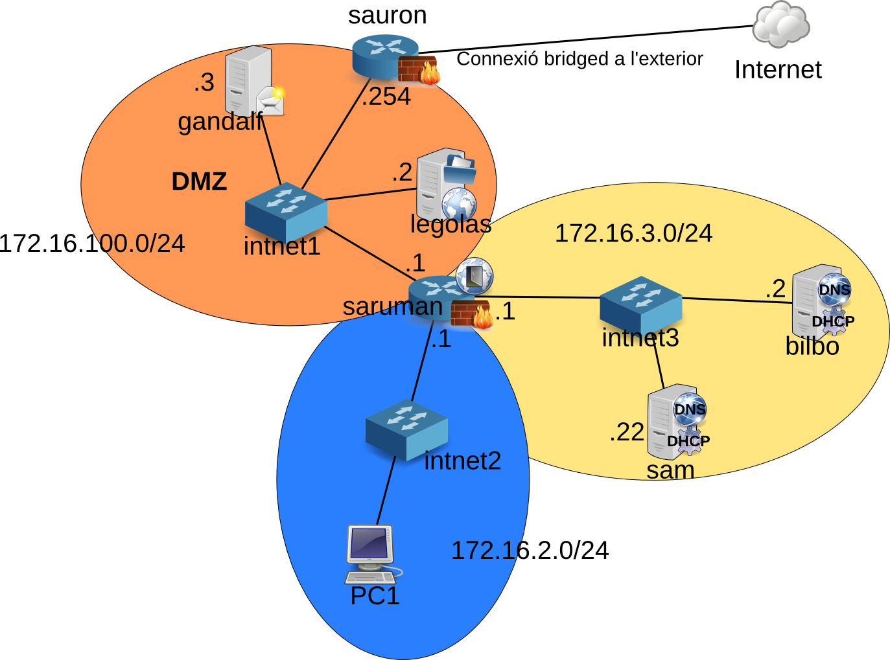

= Pràctica: preparació de l'entorn

:doctype: article
:encoding: utf-8
:lang: ca
:toc: left
:toclevels: 3
:numbered:
//:teacher:

ifdef::teacher[]
(Versió del professor)
endif::teacher[]

////
ifndef::teacher[]
.Entregar
====
*Resposta*
====
endif::teacher[]
ifdef::teacher[]
.Solució
====
*Solució*
====
endif::teacher[]
////

<<<

== Preparació de l'entorn de laboratori

<<<

=== Màquina virtual base

Com que haurem d'instal·lar una colla de màquines virtuals, el millor serà
fer-ne una de model i clonar-la diversos cops, per no haver de tornar a fer
tot el procés d'instal·lació.

La màquina base la farem amb les següents característiques:

. Basat en Debian Jessie. Màquina virtual amb 512 MB de memòria sense entorn
gràfic.
. Assignar el nom *base* durant la instal·lació.
. Durant la instal·lació, crear l'usuari amb el qual treballarem:

[IMPORTANT]
====
A cadascuna de les màquines virtuals heu de crear un usuari amb l'estructura
*CognomInicialNom*, per exemple en Toni Lòpez crearà un usuari anomenat
lopezt, tot en minúscula i sense accents ni lletres no angleses.

AQUEST USUARI SERÀ UTILITZAT OBLIGATORIAMENT A TOTES LES PRÀCTIQUES, NO
UTILITZEU L'USUARI ROOT.
====

==== Verificar repositoris

Abans de començar a treballar cal:

. Verificar que els repositoris siguin els adequats
+
ifndef::teacher[]
.Entregar
====
*Resposta*
====
endif::teacher[]
ifdef::teacher[]
.Solució
====
[source,bash]
----
root@base:~# cat /etc/apt/sources.list
#

# deb cdrom:[Debian GNU/Linux 8.3.0 _Jessie_ - Official amd64 DVD Binary-1 20160123-19:03]/ jessie contrib main

# deb cdrom:[Debian GNU/Linux 8.3.0 _Jessie_ - Official amd64 DVD Binary-1 20160123-19:03]/ jessie contrib main

deb http://ftp.es.debian.org/debian/ jessie main
deb-src http://ftp.es.debian.org/debian/ jessie main

deb http://security.debian.org/ jessie/updates main contrib
deb-src http://security.debian.org/ jessie/updates main contrib

# jessie-updates, previously known as 'volatile'
deb http://ftp.es.debian.org/debian/ jessie-updates main contrib
deb-src http://ftp.es.debian.org/debian/ jessie-updates main contrib
root@base:~#
----
====
endif::teacher[]
. Actualitzar els indexos locals contra els repositoris escollits.
+
ifndef::teacher[]
.Entregar
====
*Resposta*
====
endif::teacher[]
ifdef::teacher[]
.Solució
====
[source,bash]
----
apt-get update
----
====
endif::teacher[]
. Actualitzar els paquets del sistema a les versions més actuals.
+
ifndef::teacher[]
.Entregar
====
*Resposta*
====
endif::teacher[]
ifdef::teacher[]
.Solució
====
[source,bash]
----
apt-get dist-upgrade
----
====
endif::teacher[]

==== Instal·lar les VirtualBox Guest Additions a *base*

Les *Guest Additions* s'han de compilar per la versió concreta del nucli que
estem utilitzant. Per fer això necessitem els programes que compilen i munten
un executable (*gcc* i *make*), les capçaleres del nucli (permeten enllaçar
un programa amb el nucli), i un programa que automatitza aquest procés (*dkms*).

Afortunadament, el *dkms* ja inclou com a dependències a tots els altres.

. Instal·lar prerequisits:
+
[source, bash]
----
apt-get install dkms
----
. Muntar la unitat virtual i executar l'script d'instal·lació.
+
Per muntar la unitat de CD virtual, anem a l'opció *Dispositius->Insereix
la imatge de CD de les Guest Additions...* Això descarregarà l'última versió
de les Guest Additions i les pondrà a disposició de la màquina virtual.
+
Per accedir-hi des de la màquina virtual:
+
[source, bash]
----
mount /dev/cdrom /media/cdrom
cd /media/cdrom
sh VBoxLinuxAdditions.ru
----

==== Compartir una carpeta amb el host

Crear una carpeta compartida entre el nostre ordinador i la màquina virtual
facilitarà poder traspassar fitxers d'una banda a l'altra després.

. Crear una carpeta al host, per exemple, suposem que el seu nom és *shared*.
. A la configuració de la màquina virtual del VirtualBox, anem a *Carpetes
compartides* i n'afegim una amb *+*. Posem la ruta on es troba la carpeta al
host, i el nom que volem que tingui al guest, per exemple *shared*. Seleccionem
*Munta automàticament*.
. La carpeta compartida es troba a */media/sf_shared*.

==== Eines de monitoratge de xarxa

* També pot ser útil instal·lar alguna eina de monitoratge de xarxa, com
el *tcpdump*.
+
[source,bash]
----
apt-get install tcpdump
----

==== Prompt i usuaris

* Verifiqueu que el vostre usuari té permís de sudo a totes les màquines. La
forma més fàcil d'aconseguir això és afegir l'usuari al grup *sudo*.
+
[source,bash]
----
apt-get install sudo
adduser lopezt sudo
----
+
[IMPORTANT]
====
Cal que configureu el vostre terminal per a què al prompt aparegui el vostre nom
i la data ressaltat en diferents colors. *Això és imprescindible per avaluar
les captures*.
====
+
Cal editar el fitxer *.bashrc* situat a la home del vostre usuari. Aquest fitxer
conté la configuració del terminal.
+
Busqueu la línia que conté `force_color_prompt=yes` i descomenteu-la.
+
Una mica més avall trobarem una secció com:
+
[source,bash]
----
if [ "$color_prompt" = yes ]; then
    PS1='${debian_chroot:+($debian_chroot)}\[\033[01;32m\]\u@\h\[\033[00m\]:\[\033[01;34m\]\w\[\033[00m\]\$ '
else
    PS1='${debian_chroot:+($debian_chroot)}\u@\h:\w\$ '
fi
----
+
Només cal afegir l'expressió `\d \t` a la segona línia:
+
[source,bash]
----
if [ "$color_prompt" = yes ]; then
    PS1='${debian_chroot:+($debian_chroot)}\[\033[01;32m\]\d \t \u@\h\[\033[00m\]:\[\033[01;34m\]\w\[\033[00m\]\$ '
else
    PS1='${debian_chroot:+($debian_chroot)}\u@\h:\w\$ '
fi
----
+
A partir d'ara el prompt de la màquina Linux hauria de ser com el de la imatge, llevat del nom de màquina:
+
[source,bash]
----
Mon Jul 04 18:59:55 queraltj@base:~$
----

==== Creació de màquines virtuals basades en *base*

Un cop hem fet tot això, per crear altres màquines virtuals, només hem de fer
un parell de tasques:

. Seleccionar la màquina *base* al VirtualBox i prémer l'opció *clona*
del menú.
. Indicar al VirtualBox el nom de la nova màquina i seleccionar la casella per
tal que reincialitzi l'adreça MAC de la targeta de xarxa.
. Arrencar la màquina i canviar-li el nom. Per canviar el nom cal:
.. Executar `hostnamectl set-hostname <nou_nom_de_la_màquina>`.
.. Editar el fitxer `/etc/hosts` i canviar el nom vell pel nou nom allà on
aparegui.

=== Preparació de *saruman*

. Clonada de *base*.
. Assignar el nom *saruman*.
. Al VirtualBox, configurar tres targetes de xarxa connectades a tres xarxes
internet diferents:
.. `intnet1`
.. `intnet2`
.. `intnet3`
. Configuració dels paràmetres de xarxa a */etc/network/interfaces*
+
ifndef::teacher[]
.Entregar
====
*Resposta*
====
endif::teacher[]
ifdef::teacher[]
.Solució
====
[source,bash]
----
ifdown --all
----

[source,bash]
----
# This file describes the network interfaces available on your system
# and how to activate them. For more information, see interfaces(5).

source /etc/network/interfaces.d/*

# The loopback network interface
auto lo
iface lo inet loopback

# The primary network interface
allow-hotplug eth0
auto eth0
iface eth0 inet static
address 172.16.100.1
netmask 255.255.255.0
gateway 172.16.100.254

allow-hotplug eth1
auto eth1
iface eth1 inet static
address 172.16.2.1
netamsk 255.255.255.0

allow-hotplug eth2
auto eth2
iface eth2 inet static
address 172.16.3.1
netmask 255.255.255.0
----

[source,bash]
----
ifup --all
----
====
endif::teacher[]

. Configuració dels DNS a */etc/resolv.conf*
+
ifndef::teacher[]
.Entregar
====
*Resposta*
====
endif::teacher[]
ifdef::teacher[]
.Solució
====
[source,bash]
----
domain localdomain
search localdomain
nameserver 8.8.8.8
nameserver 8.8.4.4
----
====
endif::teacher[]

. Cal convertir aquesta màquina en un router. Recordeu que normalment quan una
màquina rep un paquet que no va dirigit a ella simplement s'elimina. Cal
modificar aquest comportament de manera que els paquets rebuts i no dirigits a
la pròpia màquina es reenviin en funció de les taules d'encaminament.
+
Habilitar aquest comportament rep el nom d'habilitar el *forwarding* de paquets.
+
Per fer-ho hi ha dues possibilitats, la primera és modificar el contingut del
fitxer */proc/sys/net/ipv4/ip_forward* i posar un 1 enlloc d'un 0.
+
[source,bash]
----
echo 1 > /proc/sys/net/ipv4/ip_forward
----
+
Fer-ho d'aquesta manera *no fa permanent el canvi*, al reiniciar la màquina es
restaura la configuració de forwarding a la opció que estigués per defecte.
+
Per fer el canvi permanent cal modificar el fitxer */etc/sysctl.conf*.
+
[source,bash]
----
#
# /etc/sysctl.conf - Configuration file for setting system variables
# See /etc/sysctl.d/ for additional system variables.
# See sysctl.conf (5) for information.
#

....

# Uncomment the next line to enable packet forwarding for IPv4
net.ipv4.ip_forward=1 # Habilitar aquesta línia
....
----

. Per verificar que el "forwarding" està configurat correctament.
+
[source,bash]
----
root@proxy~# man sysctl
root@proxy~# sysctl -a | grep ip_forward
net.ipv4.ip_forward = 1
----

. Finalment cal revisar la taula de rutes per assegurar que aquest node coneix
totes les rutes necessaries pel seu funcionament.
+
ifndef::teacher[]
.Entregar
====
*Resposta*
====
endif::teacher[]
ifdef::teacher[]
.Solució
====
[source,bash]
----
root@saruman:~# route
Kernel IP routing table
Destination     Gateway         Genmask         Flags Metric Ref    Use Iface
default         172.16.100.254  0.0.0.0         UG    0      0        0 eth0
172.16.2.0      *               255.255.0.0     U     0      0        0 eth1
172.16.3.0      *               255.255.255.0   U     0      0        0 eth2
172.16.100.0    *               255.255.255.0   U     0      0        0 eth0

----
====
endif::teacher[]

. Afegir les rutes necessàries per al correcte funcionament del router.
+
Hi ha varies maneres d'afegir rutes a un sistema Debian. Es poden utilitzar les
comandes *route* o *ip route*, en aquest cas les rutes *no* són permanents i
caldrà afegir-les cada cop que arranqui el sistema.
+
La segona opció és utilitzar les comandes anteriors però dins del fitxer
*/etc/network/interfaces*. Doneu un cop d'ull a *man interfaces*, opcions
*pre-down* i *post-up*.
+
ifndef::teacher[]
.Entregar
====
*Resposta*
====
endif::teacher[]
ifdef::teacher[]
.Solució
====
Les tres xarxes involucrades estan connectades directament al node, per tant no
calen més rutes.
====
endif::teacher[]

=== Configuració de *sauron*

. Clonada de *base*.
. Assignar el nom *sauron*.
. Al VirtualBox, configurar dues targetes de xarxa:
.. Adaptador pont
.. Xarxa interna `intnet1`
. Configuració dels paràmetres de xarxa a */etc/network/interfaces*
+
ifndef::teacher[]
.Entregar
====
*Resposta*
====
endif::teacher[]
ifdef::teacher[]
.Solució
====
[source,bash]
----
ifdown --all
----

[source,bash]
----
# This file describes the network interfaces available on your system
# and how to activate them. For more information, see interfaces(5).

source /etc/network/interfaces.d/*

# The loopback network interface
auto lo
iface lo inet loopback

# The primary network interface
allow-hotplug eth0
auto eth0
iface eth0 inet static
address 192.168.1.90
netmask 255.255.255.0
gateway 192.68.1.1

allow-hotplug eth1
auto eth1
iface eth1 inet static
address 172.16.100.254
netmask 255.255.255.0
----

[source,bash]
----
ifup --all
----
====
endif::teacher[]

. Configuració dels DNS a */etc/resolv.conf*
+
ifndef::teacher[]
.Entregar
====
*Resposta*
====
endif::teacher[]
ifdef::teacher[]
.Solució
====
[source,bash]
----
domain localdomain
search localdomain
nameserver 8.8.8.8
nameserver 8.8.4.4
----
====
endif::teacher[]

. Com hem fet abans amb *saruman*, cal convertir aquesta màquina en un router.
+
Al fitxer */etc/sysctl.conf*:
+
[source,bash]
----
#
# /etc/sysctl.conf - Configuration file for setting system variables
# See /etc/sysctl.d/ for additional system variables.
# See sysctl.conf (5) for information.
#

....

# Uncomment the next line to enable packet forwarding for IPv4
net.ipv4.ip_forward=1 # Habilitar aquesta línia
....
----

. Per verificar que el "forwarding" està configurat correctament:
+
[source,bash]
----
root@proxy~# man sysctl
root@proxy~# sysctl -a | grep ip_forward
net.ipv4.ip_forward = 1
----

. Configurar el NAT
+
Per fer-ho utilitzarem el paquet *iptables* que proporciona característiques
de firewall al node.

[source,bash]
----
# iptables-persistent guarda la configuració actual de iptables
apt-get install iptables-persistent
iptables -t nat -A POSTROUTING -o eth0 -j MASQUERADE
iptables -A FORWARD -i eth1 -j ACCEPT
# Recarreguem la configuració inicial de iptables-persistent
dpkg-reconfigure iptables-persistent
----

A la primera instrucció d'*iptables* estem indicant que volem afegir una regla
(*-A*), per fer NAT (*-t nat*) a tots els paquets que sortin per *eth0*
(*-o eth0*). El canvi que fem als paquets és donar-los la IP pública del
router, per tal que la resposta pugui arribar-nos des d'Internet
(*-j MASQUERADE*). El canvi el fem just abans d'enviar el paquet
(*POSTROUTING*).

A la segona instrucció d'*iptables* estem indicant que volem afegir una regla
(*-A*) que s'apliqui a tots els paquets que ens arriben de la xarxa interna, és
a dir, a través de *eth1* (*-i eth1*). La regla especifica que aquests
paquets seran acceptats sempre (*-j ACCEPT*) i que es redirigiran allà on
toqui segons la taula d'enrutament (*FORWARD*).

La configuració queda guardada a */etc/iptables/rules.v4*

. Finalment cal revisar la taula de rutes per assegurar que aquest node coneix
totes les rutes necessàries pel seu funcionament.
+
ifndef::teacher[]
.Entregar
====
*Resposta*
====
endif::teacher[]
ifdef::teacher[]
.Solució
====
[source,bash]
----
root@sauron:~# route
Kernel IP routing table
Destination     Gateway         Genmask         Flags Metric Ref    Use Iface
default         192.168.1.1     0.0.0.0         UG    0      0        0 eth0
172.16.100.0    *               255.255.255.0   U     0      0        0 eth1
192.168.1.0     *               255.255.255.0   U     0      0        0 eth0

----

Aquest router desconeix on són les xarxes 172.16.0.0/16, per tant caldrà afegir
les rutes adequades per indicar-li el camí.
====
endif::teacher[]

. Afegir les rutes necessàries per al correcte funcionament del router.
+
Hi ha diverses maneres d'afegir rutes a un sistema Debian. Es poden utilitzar
les comandes *route* o *ip route*, en aquest cas les rutes *no* són permanents
i caldrà afegir-les cada cop que arranqui el sistema.
+
La segona opció és utilitzar les comandes anteriors però dins del fitxer
*/etc/network/interfaces*. Doneu un cop d'ull a *man interfaces*, opcions
*pre-down* i *post-up*.
+
ifndef::teacher[]
.Entregar
====
*Resposta*
====
endif::teacher[]
ifdef::teacher[]
.Solució
====
[source,bash]
----
# This file describes the network interfaces available on your system
# and how to activate them. For more information, see interfaces(5).

source /etc/network/interfaces.d/*

# The loopback network interface
auto lo
iface lo inet loopback

# The primary network interface
allow-hotplug eth0
auto eth0
iface eth0 inet static
address 192.168.1.90
netmask 255.255.255.0
gateway 192.68.1.1

allow-hotplug eth1
auto eth1
iface eth1 inet static
address 172.16.100.254
netmask 255.255.255.0
### Rutes estatiques ###
post-up route add -net 172.16.0.0 netmask 255.255.0.0 gw 172.16.100.1
pre-down route del -net 172.16.0.0 netmask 255.255.0.0 gw 172.16.100.1
----
====
endif::teacher[]

=== Preparació de les màquines virtuals servidor

En principi les màquines virtuals sobre les quuals s'instal·laran servidors
haurien de ser màquines sense cap entorn gràfic instal·lat. No obstant per
facilitar la feina d'administració es permetrà la instal·lació d'algun
escriptori lleuger en aquestes màquines.

Es permet la instal·lació d'un dels següents escriptoris lleugers:

* XFCE
* LXDE
* Mate
* Cinnamon (Pot donar problemes amb les màquines virtuals)

[IMPORTANT]
====
No instal·leu un escriptori pesat a les màquines servidor. En particular *no*
instal·leu:

* gnome3
* kde
====

==== Desinstal·lar el network manager

El *network-manager* és un component que permet gestionar les conexions de
xarxa des d'un entorn gràfic. És incompatible amb la configuració mitjançant
fitxers de text.

No es recomana el seu ús en les màquines que actuen com a servidor i per tant
el desinstal·larem.

Les màquines que actuen com a client sí que poden tenir instal·lat aquest
component.

. Desinstal·lar el paquet *network-manager* i els seus fitxers de configuració.
+
ifndef::teacher[]
.Entregar
====
*Resposta*
====
endif::teacher[]
ifdef::teacher[]
.Solució
====
[source,bash]
----
apt-get remove --purge network-manager
----
====
endif::teacher[]

==== Configuració de la xarxa

La configuració serà diferent depenent del servidor que estiguem configurant.
Per a les primeres pràctiques necessitarem el servidor *bilbo*.

En qualsevol cas, s'ha d'assignar la IP fixa indicada a l'esquema de la xarxa
i la passarel·la correponent a la xarxa on es troba el servidor.

. Configurar la xarxa manualment a */etc/network/interfaces*
+
ifndef::teacher[]
.Entregar
====
*Resposta*
====
endif::teacher[]
ifdef::teacher[]
.Solució
====
Per exemple, per a *bilbo*:

[source,bash]
----
# This file describes the network interfaces available on your system
# and how to activate them. For more information, see interfaces(5).

source /etc/network/interfaces.d/*

# The loopback network interface
auto lo
iface lo inet loopback

# The primary network interface
allow-hotplug eth0
auto eth0
iface eth0 inet static
address 172.16.3.2
netmask 255.255.255.0
gateway 172.16.3.1
----
====
endif::teacher[]
