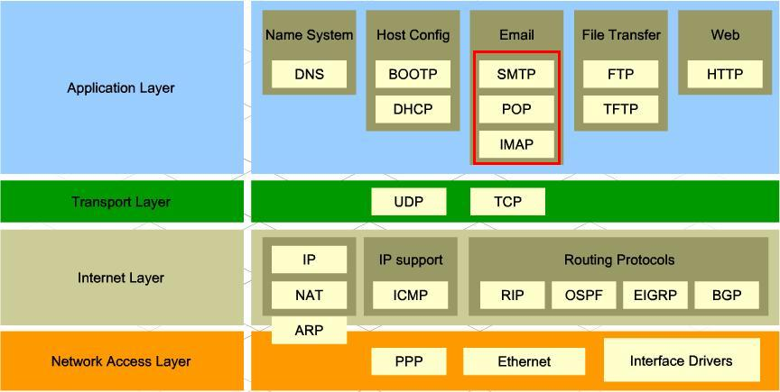
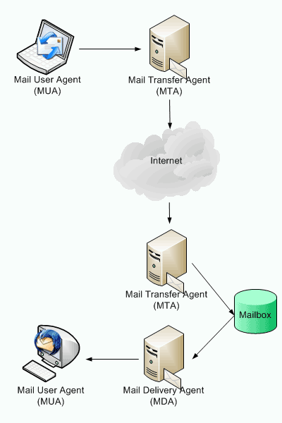
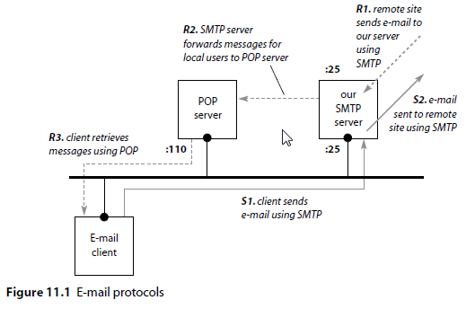

= Correu electrònic
:encoding: utf-8
:doctype: article
:lang: ca
:toc: left
:toclevels: 4
:numbered:
:teacher:

<<<

== Introducció

* Raymond Samuel Tolimlinson va implementar el primer sistema d'email el 1971
sobre ARPANET.

* Fou el primer sistema capaç d'enviar correu entre usuaris a diferents hosts
connectats a ARPANET.

* Consisteix en l’enviament i recepció de missatges de text (més arxius
  adjunts) d’un usuari origen a un usuari destí sense necessitat que el
  destinatari estigui connectat.

* Característiques similars a la transferència d’arxius (FTP) però amb la
diferència que aquest:

    - Permet la transmissió de missatges a més d’un usuari.
    - Informació ben estructurada, on a més s’inclou informació del remitent,
    del destinatari i la data d’enviament.
    - Les adreces tenen normalment el format
    mailto:nomuser@nomequip.domini[nomuser@nomequip.domini]
    - És fàcil de fer servir pels usuaris.
    - És un procés asíncron: el receptor no cal que estigui connectat quan
    l'emissor envia el correu i l'emissor no cal que estigui connectat quan
    el receptor el rep.

* L’arrova  és un símbol d’orígen àrab d’al-rub i designa una mesura de volum o
pes, variable en funció de les èpoques i les regions.

* El dibuix d’una lletra a envoltada pel seu propi traç és molt antic, ja
que ja era d’ús comú en el segle XVI com a indicatiu de mesura.

* Amb el pas del temps va esdevenir un terme comercial que designava el preu
unitari d’un grup de compres. Per exemple, dins del món anglosaxó, va
acabar per identificar-se i pronunciar-se com la paraula anglesa "at", això és,
la conjunció "a" de, per exemple, “cinc barrils ‘a’ 100 morabatins cadascun”.

* La utilització del símbol arrova en la llengua anglesa explica la
presència del símbol en els primers teclats i, per tant, en els
terminals informàtics que s’utilitzaven durant la programació de la
xarxa ARPANET.

* Va ser precisament la seva presència en el teclat el que va fer que
l’enginyer Ray Tomlinson s’hi fixés i l’escollís per resoldre el
problema del format de les adreces a les quals s’enviaven els correus
electrònics.

== Agents

* Un agent de correu electrònic és un programa
 que forma part de la infraestructura de correu elecrònic. És una manera
 tècnica de referir-se a les funcions realitzades pels diferents
 programes involucrats en l'enviament de correu electrònic.

* Els dos agents més importants són:

    - MUA – Mail User Agent
    - MTA – Mail transfer Agent

* Es poden considerar més agents com ara MS(ubmission)A, MD(elivery)A,
MR(etrieval)A.

=== Mail User Agent (MUA)

* Són les sigles de Mail User Agent.

* Informalment s'anomena client de correu

* És el programari encarregat d'accedir i gestionar el compte de correu d'un
usuari.

* Interactua directament amb l'usuari a través d'un programa client.

* Thunderbird, Outlook (Microsoft) o mail (Linux) són MUAs.

=== Mail Delivery Agent (MDA)

* Són les sigles de Mail Delivery Agent.

* És un programari responsable de l'entrega de missatges de correu electrònic
d'un servidor de correu a un MUA.

* Maildrop (unix), Qpopper, Dovecot, Courier són MDAs.

=== Mail Transfer Agent (MTA)

* Són les sigles de Mail Transfer Agent.

* Té la responsabilitat d'enviar el correu cap al MTA que emmagatzema la
bústia de correu del receptor.

* Els MTA també s'anomenen servidors de correu.

* Postfix, sendmail, Exim, Qmail són MTAs

=== Resum Agents

* L'emissor utilitza un MUA per generar un «email».

* El MUA client envia el correu al MTA on el client té la seva bustia de correu.

* El MTA del client envia el correu a un altre MTA que és on resideix la
bústia de correu del receptor.

* El MTA del receptor cedeix el correu a un MDA associat a la bústia de
correu del receptor.

* El receptor utilitza un MUA per comprovar i recuperar els missatges del MDA.

== Estàndards

* TCP/IP divideix els estàndards de correu electrònic en dos conjunts:

    - Segons el RFC 2822 un «email» es representa en text i es divideix en dues
    parts, capçalera i cos, separats per una línia en blanc.

    - Per altra banda es defineixen els protocols que permeten l'intercanvi de
    correus electrònics entre dues màquines.

        * POP3, Post Office Protocol
        * IMAP, Internet Message Access Protocol
        * SMTP,  Simple Mail Transfer Protocol

=== Estàndards RFC2822

* L'estàndard pels correus electrònics especifica el format exacte de les
capçaleres dels correus deixa el format del cos a mans del emissor.

* En particular:

    - La capçalera conté text llegible.
    - Dividit en línies consistents en una paraula clau : valor
    - Algunes paraules clau són obligatòries i d'altres opcionals.

* Per Exemple:

    - La línia que comença amb To: conté l'adreça de correu del receptor
    - La línia que comença amb From: conté l'adreça de correu de l'emissor.
    - De manera opcional l'emissor pot especificar una adreça de correu a la
    qual enviar la contestació Reply-to:

=== Protocol SMTP

* El protocol SMTP especifica com enviar missatges de correu electrònic
a un MTA.

* NO especifica:

    - Com un usuari pot accedir al seu correu entrant.

==== Protocol SMTP - Característiques

* Tota la comunicació entre client i servidor es realitza en format ASCII.
* Cada línia comença amb una comanda (pot ser una abreviació o un número
  de 3 dígits).
* La resta de línia o bé dóna arguments a la comanda o bé és text que els
humans poden utilitzar per «debugar» el sistema.

Per exemple:

* A l'inici el client estableix una connexió amb el servidor i espera que
aquest enviï: 220 READY FOR MAIL
* A continuació el client envia: HELO o EHLO en funció de les extensions de
servidor suportades.

Els humans poden interpretar fàcilment les interaccions entre el client i
el servidor donat que cada comanda apareix en una línia diferent i la
codificació es realitza en text ASCII llegible.

==== Protocol SMTP - Exemple

----
S: 220 Beta.gov Simple Mail Transfer Service Ready
C: HELO Alpha.edu
S: 250 Beta.gov
C: MAIL FROM:<Smith@Alpha.edu>
S: 250 OK
C: RCPT TO:<Jones@Beta.gov>
S: 250 OK
C: RCPT TO:<Green@Beta.gov>
S: 550 No such user here
C: RCPT TO:<Brown@Beta.gov>
S: 250 OK
C: DATA
S: 354 Start mail input; end with <CR><LF>.<CR><LF>
C: ..envia el cos del missatge...
C: ...continua amb tantes línies com les que contingui el missatge
C: <CR><LF>.<CR><LF>
S: 250 OK
C: QUIT
S: 221 Beta.gov Service closing transmission channel
----

=== Estàndards per accedir al correu

* La IETF defineix dos protocols que permeten que un MUA accedeixi a una bústia
de correu situada en un MTA. El protocol POP i el protocol IMAP.

* Tot i que tenen una funcionalitat similar ambdós protocols prenen
aproximacions oposades:

    - L'un permet a l'usuari baixar una còpia dels missatges de la seva bústia
    de correu.
    - L'altre permet a l'usuari veure i manipular els missatges directament al
    servidor (MTA).

==== Protocol POP

* POP significa Post Office Protocol

* Actualment s'utilitza la versió 3 del protocol anomenada POP3 o POP3S en la
seva versió segura.

* L'usuari invoca una aplicació client POP3 que crea una connexió TCP a un
servidor POP3 en l'ordinador on resideix la bústia de correu de l'usuari.

* L'usuari s'autentifica (login + password).

* El client envia comandes per recuperar una còpia d'un o més missatges i
eliminar els missatges de la bustia del servidor. És important notar que
un servidor de correu ha de proporcionar dos serveis (és en realitat dos
servidors), per una banda el servei SMTP per a poder rebre correus a les
diferents bústies dels diferents usuaris, per l'altra, el servei POP3 per
permetre als usuaris accedir a les seves bústies de correu.

==== Protocol IMAP

* IMAP significa Internet Message Access Protocol.

* La versió 4 del protocol IMAP, IMAP4 i IMAPS en la seva versió segura, és
una alternativa a POP3 que permet als usuaris veure i manipular
missatges al servidor.

=== Extensions MIME

* Els estàndards referents al correu electrònic es vàren crear en un moment
on els missatges de correu consistien únicament en text.

* Per permetre la transmissió d'elements no ASCII a través del correu
electrònic (és a dir, afegir adjunts als missatges de correu) la IETF va
crear les extensions MIME (Multipurpose Internet Mail Extensions).

* Les extensions MIME permeten codificar en ASCII dades arbitraries, i per
tant permet que es puguin transmetre per la infraestructura de correuexistent.

* Per a poder fer reversible el procés els missatges MIME inclouen una
capçalera on s'especifica la versió MIME utilitzada, el tipus de dades
encapsulades i la codificació utilitzada per convertir les dades originals en
ASCII.

* Per a gestionar els diferents adjunts el estàndard MIME defineix que un
Content-type ha d'especificar dos identificadors, un tipus i un subtipus
separats per /.

* L'estàndard MIME defineix 7 tipus bàsics:
    - text, Textual (per exemple un document).
    - image
    - audio
    - video
    - application, dades arbitraries per a un programa
    - multipart, múltiples missatges amb diferents content types i encodings
    - message, un correu electrònic sencer

==== Extensions MIME - Exemples

Exemple de missatge MIME:

----
From: bill@test.edu
To: john@exemple.com
MIME-Version: 1.0
Content-Type: image/jpeg
Content-Transfer-Encoding: base64
----

I les dades enviades:

----
9j/4AAQSkZJRgABAQEAYABgAAD/4QBERXhpZgAATU0AKgAAAAgAA0AAAAMAAAABAAAAAEABAAEAAAABAAAAAEACAAIAAAAKAAAAMgAAAAB0d2ltZy5jb20A/9sAQwANCQoLCggNCwsLDw4NEBQhFRQSEhQoHR4YITAqMjEvKi4tNDtLQDQ4RzktLkJZQkdOUFRVVDM/XWNcUmJLU1RR/9sAQwEODw8UERQnFRUnUTYuNlFRUVFRUVFRUVFRUVFRUVFRUVFRUVFRUVFRUVFRUVFRUVFRUVFRUVFRUVFRUVFRUVFR/8AAEQgAgACAAwEiAAIRAQMRAf/EAB8AAAEFAQEBAQEBAAA
----

Base64 codifica cada 64 bits en un símbol ASCII:

----
ABCDEFGHIJKLMNOPQRSTUVWXYZ abcdefghijklmnopqrstuvwxyz +/
----

Un altre exemple:

----
From: bill@acollege.edu
To: john@example.com
MIME-Version: 1.0
Content-Type: Multipart/Mixed; Boundary=StartOfNextPart
--StartOfNextPart
Content-Type: text/plain
Content-Transfer-Encoding: 7bit

John,

Here is the photo of our research lab that I promised
to send you. You can see the equipment you donated.

Thanks again,

Bill
--StartOfNextPart
Content-Type: image/gif
Content-Transfer-Encoding: base64
...data for the image...
----
