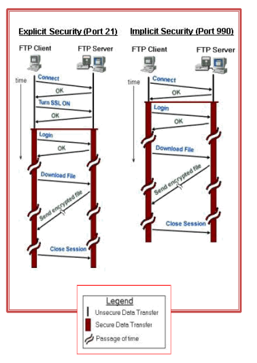

= Transferència de fitxers
:encoding: utf-8
:doctype: article
:lang: ca
:toc: left
:numbered:
:teacher:

<<<

== Protocol FTP

* L’FTP (File Transfer Protocol) és el protocol que proporciona el servei de
transferència de fitxers més usat.

* Es basa en una arquitectura client/servidor i utilitza el protocol de
transport TCP.

* Permet la transferència de fitxers de qualsevol tipus entre dos equips.

* El servidor actua a mode de repositori de fitxers i el client s’hi connecta
per baixar (download) o pujar (upload) fitxers.

* Aquesta transferència és independent de la plataforma usada i del tipus de
fitxers gestionats.

* La primera especificació del protocol FTP apareix al 1980.

* L’octubre de 1985 es publica l’RFC 959, que és la base del protocol actual. A
aquest RFC se n’hi han afegit posteriorment d’altres per incorporar seguretat,
internacionalització...

* Una de les virtuts del model FTP és que permet transferir fitxers (també
modificar-los, esborrar-los, afegir-los…) independentment de la plataforma i del
sistema on resideixen.

* La debilitat principal del protocol FTP és la falta de seguretat. Tot el
flux de dades viatja en text pla, sense xifrar, fins i tot els noms d’usuari i
les contrasenyes. Això ha obligat a adoptar noves estratègies per proporcionar
confidencialitat a les transmissions.

* Els objectius del servei FTP són els següents:

  * Compartir fitxers tant de dades com de programes.

  * Permetre prosseguir les transferències de fitxers un cop interrompudes
  (reprendre les baixades).

  * Transferir dades de manera eficient i fiable.

* El servidor FTP es pot classificar segons sigui:

  * D’accés públic / d’accés corporatiu.

  * D’accés amb usuari identificat / d’accés amb usuari anònim.

  * De mode de transferència ASCII / de mode de transferència binari.

* De forma inusual, el servei FTP utilitza dos ports del sistema.

  * A través del port 21 es realitza la interpretació de les instruccions.

  * El port 20 és destinat a la transferència de dades, tot i que es pot
  utilitzar un altre port dinàmic en el seu lloc.

  * El mode real de funcionament de la transmissió de dades i els ports
implicats depenen del mode de funcionament, que pot ser actiu o passiu.

* La funcionalitat del servei es classifica en:

  * Mode intèrpret del protocol.

  * Mode de transferència de dades.

== Servei FTP – Accés identificat / usuari anònim

* Segons el tipus de clients que accepta, podem classificar els servidors FTP de
la manera següent:

  * Usuari identificat. El servidor requereix un nom d’usuari i una contrasenya
  vàlids per accedir al servei.

  * Els comptes d’usuari poden ser gestionats directament per l’aplicació del
servidor o se’n pot delegar l’autenticació al sistema operatiu.

  * Accés anònim. Un servidor que permet accessos anònims permet que qualsevol
  usuari pugui accedir al repositori de fitxers.

  * Usualment cal indicar com a nom d’usuari “anonymous” i com a contrasenya
s’accepta qualsevol text, però per convenció s’escriu el correu electrònic de
l’usuari.

== Servei FTP – Accés public / Accés coropratiu

* Segons l’àmbit del servei que proporciona, podem classificar els servidors FTP
de la manera següent:

  * Servidor públic. Molts servidors FTP a Internet ofereixen servei d’accés
  anònim a mode de repositoris de programari perquè els usuaris el puguin
  utilitzar. N’hi ha que actuen com a rèpliques (miralls, mirrors) d’altres
  repositoris per tal d’apropar les baixades a l’usuari. Aquest servei és
  usualment només de lectura (pel client) i en sistemes GNU/Linux s’ubica
  sovint en els directoris /var/ftp o /var/ftp/pub.

  * Servidor corporatiu. No cal oferir per força els serveis FTP a Internet;
  l’administrador de xarxa pot configurar el servidor FTP per oferir els
  serveis als equips que cregui oportuns. Dins d’una xarxa corporativa es pot
  disposar d’un o més servidors FTP que permeten l’accés als usuaris de la
  xarxa (tant a usuaris identificats com a usuaris anònims de la xarxa
  corporativa).

== Servei FTP – Mode de transferència ASCII / Binari

* Els modes en què es transfereixen els fitxers entre el client i el servidor
poden ser múltiples. Els dos més importants són aquests:

  * ASCII. El fitxer es transmet caràcter a caràcter. Els caràcters han de
  correspondre als caràcters del codi bàsic ASCII. Si el fitxer conté caràcters
  ASCII no vàlids, la transferència fallarà. Per tant, es tracta d’un mode vàlid
  únicament per transferir text net. El receptor farà les conversions de
  caràcter necessàries per desar les dades en el format que requereixi.

  * Binari (binary). Quan el mode de transferència és binari, el fitxer s’envia
  bit a bit sense interpretació de cap mena. És el mode que cal usar per
  transmetre programes, imatges, vídeo, so, dades binàries...

== Servei FTP - Ports

* Tant en el client com en el servidor hi ha dues entitats clarament
diferenciades:

  * Intèrpret del protocol: és l’encarregat de l’intercanvi d’ordres i respostes
  entre client i servidor. Utilitza el canal de control establert entre el port
  de sortida del client i el port 21, on escolta el servidor. És l’encarregat
  d’interpretar les ordres de l’aplicació client convertint-les en instruccions
  FTP, executar-les en el servidor i retornar les respostes al client. No
  s’encarrega de la transferència de fitxers.

  * Transferència de dades: és la part encarregada d’intercanviar els fitxers i
  directoris entre client i servidor. En el funcionament bàsic, el canal de
  dades s’estableix entre un nou port del client (port dinàmic i específic per
  a la transmissió del fitxer) i el port 20 (ftp-data) del servidor.

* La connexió TCP del canal de dades entre client i servidor es pot establir de
dues maneres diferents:

  * Mode actiu: generalment és el mode per defecte. Abans de fer una sol·licitud
  al servidor que impliqui transferir dades pel canal de dades, el client indica
  al servidor el port dinàmic que utilitzarà. Per tant, el canal de dades
  s’estableix entre aquest port dinàmic del client i el port 20 del servidor.
  Servidor i client estableixen una nova connexió TCP per aquest canal.

  * Mode passiu: el client fa una sol·licitud de mode passiu al servidor.
 Aquest respon enviant el seu port dinàmic, per on s’establirà el canal de dades
 (en lloc del port 20). Llavors el client inicia una nova connexió TCP entre un
 port dinàmic nou seu i el port dinàmic del servidor. Aquest és el canal de
 dades.

== Servei FTP - Client

* Una vegada establerta la connexió, el client tindrà accés al sistema de
fitxers del servidor mitjançant:

  * Línies de comandes

  * Navegador

  * Programes específics, ex Filezilla

* Segons els seus privilegis i la configuració del servei, els usuaris podran
accedir a diferents zones del sistema de fitxers.

* La transferència de fitxers es pot fer en binari o en text. Actualment
s’autodetecta el tipus de fitxer i no cal especificar-ho.

* La jerarquia de fitxers s’ha de pensar de manera que sigui útil i fàcil de fer
servir per part de l’usuari.

== Servei FTP - Seguretat

* Es tracta d’un servei no segur (fins i tot l’intercanvi de claus es fa sense
  xifrar).

Per realitzar transferència de fitxers de manera segura caldria fer servir
serveis com SSH (accés remot) o SFTP (Secure FTP) que proporcionen un canal
segur. (22/TCP)

També ens podem recolzar en connexions segures fent servir SSL (Secure Socket
Layer) o TSL (Transport Layer Security) que requereixen mecanismes de xifrat i
la utilització de certificats. Hi ha dues maneres de combinar SSL o TSL amb FTP:

* FTPES o FTP Explícit: el client es connecta al port original (21) i
explícitament canvia a un mode segur TSL o SSL per transferir informació.

* FTPS o FTP Implícit: el client assumeix el mode segur TSL o SSL des de
l'inici de la sessió. Normalment es fa servir el port 990 en lloc del 21.

== Trivial FTP

El TFTP (port 69) és similar a l'FTP però no requereix autenticació d’usuari
abans de la connexió. Simplement realitza la transferència d’arxius.

Útil per carregar o descarregar fitxers de màquines de la xarxa (routers,
switchs).

Juntament amb UDP, DHCP, i IP, permet, per exemple, que un ordinador carregui
un SO. (Màquines sense Disc Dur).

* La targeta de xarxa ha de suportar el protocol PXE (Preboot eXecution
Envoiroment).

image::images/tftp.png[1000,1000]
