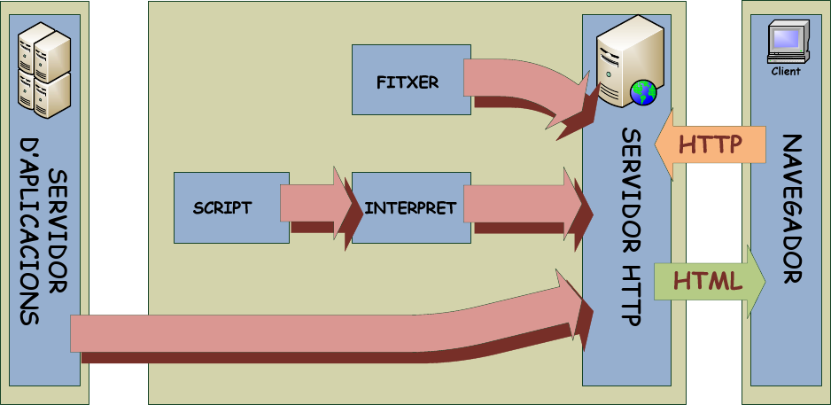
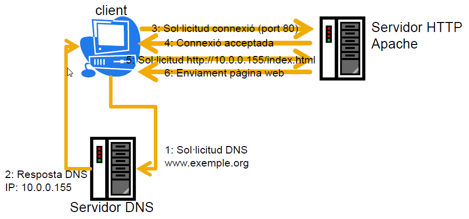

= Servidors HTTP
:encoding: utf-8
:doctype: article
:lang: ca
:toc: left
:numbered:
:teacher:

<<<

== Què és un servidor HTTP?

image::images/httpintro.jpg[]

Es defineix un *servidor HTTP* o *servidor web* com un programa que implementa
el protocol HTTP, per realitzar les seves tasques. Aquest programa s’executa
contínuament en un ordinador, quedant a l’espera de rebre sol·licituds o
peticions dels clients, efectuades mitjançant un altre programa que anomenem
*navegador web*. El servidor respon a les peticions, mitjançant pàgines web que
es mostraran en el navegador del client.

El *protocol HTTP*, _Hypertext Transfer Protocol_, està implementat en la capa
d’aplicació del model OSI de TCP/IP. Permet la transferència de _hipertexts_, i
_pàgines HTML_ (_Hypertext Markup Language_) que poden contenir imatges, texts,
fitxers, etc.

El _servidor HTTP_, un cop ha rebut una petició d’un client, prepara la pàgina
HTML, amb les imatges, arxius, etc., que llegeix connectant amb un servidor
d'aplicacions, directament des d'un arxiu (*.html, *.htm, *.xml, ...), o bé
que és el resultat de processar algun _script_. Posteriorment, en funció de com
estigui configurat el servidor HTTP, torna el resultat al programa navegador
del client.

En aquest procés, el servidor HTTP es limita a transferir el codi de la pagina
HTML, sense interpretar-la. En canvi, el programa client s’ha de encarregar
d'interpretar el codi HTML rebut, mostrant les fonts, la disposició del text,
els colors i els objectes de la pàgina.

En la primera versió del protocol HTTP (1.0), el client només podia invocar
tres operacions en el servidor: _GET_ per demanar una pàgina, _HEAD_ per demanar
la capçalera d'una pàgina i _POST_ per enviar dades a una URL.

Essent una mica més estricte, el funcionament del protocol es el següent:

- El client envia una petició al servidor. Aquesta petició està formada per un
mètode que s’invoca al servidor (_URI_) i una versió del protocol utilitzat,
seguida per un missatge de compatibilitat de versió de _MIME_ amb els paràmetres
de la petició, la informació del client i un cos opcional amb més dades per al
servidor.

----
GET /~jqueral/ HTTP/1.1
Host ies-sabadell.xtec.net
User-Agent Mozilla/5.0 (X11; U; Linux i686; ca; rv:1.9.0.15) Gecko/2009102815 Iceweasel/3.0.6 (Debian-3.0.6-3)
Accept text/html,application/xhtml+xml,application/xml;q=0.9,*/*;q=0.8
Accept-Language	ca,en-us;q=0.7,en;q=0.3
Accept-Encoding	gzip,deflate
Accept-Charset ISO-8859-1,utf-8;q=0.7,*;q=0.7
Keep-Alive 300
Connection keep-alive
Cookie MOODLEID_usuarimoodle=%25E9%25C3%251FB%25A2GET /index.html
----

- El servidor respon amb una línia d'estat, que inclou la versió del protocol
del missatge i si la petició ha tingut èxit o no, un codi de resultat, seguit
d’un missatge de compatibilitat de versió de MIME amb informació del servidor,
metainformació (dades sobre la informació), de l'entitat sol·licitada i un cos
opcional amb l’entitat sol·licitada.

----
HTTP/1.1 200 OK
Date Wed, 09 Dec 2009 22:49:26 GMT
Server Apache/2.2.9 (Debian) PHP/5.2.6-1+lenny4 with Suhosin-Patch mod_ssl/2.2.9 OpenSSL/0.9.8g mod_perl/2.0.4 Perl/v5.10.0
Vary Accept-Encoding
Content-Encoding gzip
Content-Length 471
Keep-Alive timeout=7, max=25
Connection Keep-Alive
Content-Type text/html;charset=UTF-8

<title>Pàgina web de proves<title>

...

<h2> Exemple de comunicació HTTP <h2>

----

La versió actual del protocol HTTP és la 2, publicada el maig de 2015, encara
que la major part de llocs utilitzen encara la versió 1.1, de 1997.

== Breu història i evolució del protocol HTTP

L'any 1980, Tim Berners-Lee, un investigador del CERN a Ginebra, va dissenyar
un sistema de navegació d’hipertext i desenvolupà, amb l’ajut d'en Robert
Cailliau, un software anomenat “Enquire” per a la navegació, concebut
originàriament per funcionar com una eina de comunicació entre els científics
nuclears del CERN.

L'“Enquire” era un programa per guardar peces d’informació i enllaçar-les
entre elles. A finals de 1990, en Tim Berners-Lee va finalitzar el protocol
HTTP (Protocol de transferència d’hipertext) i el protocol HTML (Llenguatge de
marcat d’hipertext) per navegar per les xarxes a través d'hipervincles. Així
nasqué la World Wide Web.

El protocol HTTP ha passat per vàries etapes:

- HTTP/0.9: primera versió. Definia un protocol senzill a nivell d’aplicació per
la distribució de dades per les xarxes.
- HTTP/1.0: La millora més destacada va ser l’ús de capçaleres (headers) amb
metainformació de les dades que es transmeten.
- HTTP/1.1: va ser definit en el RFC 2616 i integra en una sola especificació a
l’anterior HTTP/1.0 amb afegits definits en els RFC 2109, 2145 i 2617.
- HTTP/2: la primera versió nova que es publica en molts anys, definida al
RFC 7540.

El protocol HTTP 1.0 tenia unes limitacions importants d’escalabilitat i
rendiment, que van ser superades per la nova versió HTTP 1.1. Les
característiques principals de la versió 1.1 són:

- *Connexions persistents* (_keep-alive_): la idea de les connexions persistents
és reutilitzar la mateixa connexió TCP per enviar i rebre múltiples
sol·licituds i respostes HTTP, en comptes d'obrir una nova connexió per cada
parella de sol·licitud i resposta. Això té els següents avantatges:

** Menys ús de la CPU i la memòria (perquè hi ha menys connexions obertes
simultàniament).
** _HTTP pipelining_: permet enviar diverses sol·licituds HTTP utilitzant el
mateix socket, abans de rebre les respostes corresponents.
** Es redueix la congestió de la xarxa (menys connexions).
** Es redueix la latència entre connexions successives, perquè ens estalviem
la negociació de la connexió TCP.
** Podem rebre errors sense perdre la connexió TCP.

- Transmissió per “trossos” d'informació (_Chunked Transfer Encoding_) en
comptes d'enviar tota la informació en un sol paquet. Això permet l'streaming.

- Nous mètodes que s'afegeixen als ja existents (GET, POST i HEAD): DELETE,
TRACE, PUT, PATCH, COPY, MOVE, LINK, UNLINK, OPTIONS, WRAPPED...

- Nou mètode d’autenticació (_Digest access authentication_).

- Ús de *proxies* HTTP.

- Suport a *host virtuals* basats en nom. Per fer-ho possible, es va obligà que
les peticions HTTP/1.1 incorporessin un nou camp de capçalera anomenat _Host_.

- *Negociació de continguts*. Els clients i els servidors poden, mitjançant
l’intercanvi de capçaleres, negociar característiques comunes. Quan el servidor
ofereix la informació en diverses representacions, el client pot seleccionar la
que més l’interessi. Per exemple, si tenim un servidor amb la informació en
diferents idiomes, un client pot sol·licitar el contingut segons el seu idioma
de preferència.

RFC 2068 que defineix el protocol HTTP 1.1: http://www.ietf.org/rfc/rfc2068.txt

La versió HTTP/2 és altament compatible amb la HTTP/1.1, de manera que el
client i el servidor poden negociar dinàmicament quina versió utilitzen.

Algunes de les novetats de la versió HTTP/2 són les següents:

- És binari: en comptes de transmetre la informació en text, es transmet en
binari. Això redueix els possibles errors i fa els missatges més compactes.
Com a contrapartida, no es pot depurar utilitzant programes com _telnet_.
- Compressió de les capçaleres.
- Millora del _HTTP pipelining_ utilitzant multiplexat: es permet que els client
enviïn múltiples sol·licituds simultànies pel mateix canal TCP. Un client pot
utilitzar ara una sola connexió per a tota la comunicació amb un servidor.
- _HTTP/2 push_: el servidor pot enviar recursos al client abans que el client
els sol·liciti, si ja sap que el necessitarà, de manera que s'estalvien
sol·licituds i esperes.

Amb tot plegat s'aconsegueix un increment d'entre un 10% i un 40% en la
càrrega de les pàgines, i una reducció dràstica en la quantitat de connexions
TCP utilitzades.

Encara que l'estàndard no ho fa obligatori, la major part d'implementacions
forcen l'ús de xifrat en totes les connexions.

Podeu trobar més informació sobre HTTP/2 a https://http2.github.io/.

== El protocol HTTP

=== Introducció al protocol HTTP

El propòsit del protocol HTTP és permetre la transferència d'arxius
(principalment en format HTML) entre un navegador (el client) i un servidor
web, localitzat mitjançant una cadena de caràcters denominada adreça URL.

=== Comunicació entre el navegador i el servidor

La comunicació entre el navegador i el servidor es duu a terme en dues etapes:

- El navegador realitza una sol·licitud HTTP.
- El servidor processa la sol·licitud i després envia una resposta HTTP.

El processament de la sol·licitud en el servidor pot implicar moltes altres
etapes, com per exemple:

- L'execució d'scripts (com PHP).
- Consultes a bases de dades.

En qualsevol cas, el resultat final és que el servidor envia una capçalera
HTTP seguida d'una sèrie de dades (típicament HTML, però poden ser de qualsevol
tipus).

=== Sol·licitud HTTP

Una sol·licitud HTTP és un conjunt de línies que el navegador envia al
servidor. Inclou:

- *Una línia de sol·licitud*: és una línia que especifica el tipus de document
sol·licitat, el mètode que s'aplicarà i la versió del protocol utilitzada. La
línia està formada per tres elements que han d'estar separats per un espai:

    - El mètode
    - L'adreça URL
    - La versió del protocol utilitzada pel client (en general serà HTTP/1.1)

- Els *camps de capçalera de la sol·licitud*: és un conjunt de línies opcionals
que permeten aportar informació addicional sobre la sol·licitud i/o el client
(navegador, sistema operatiu, etc.). Cadascuna d'aquestes línies està formada
per un nom que descriu el tipus de capçalera seguit de dos punts (:) i el
valor de la capçalera.

- El *cos de la sol·licitud*: és un conjunt de línies opcionals que s'han de
separar de les línies precedents per una línia en blanc i, per exemple,
permeten que s'enviïn dades amb una comanda POST durant la transmissió de
dades al servidor utilitzant un formulari.

Per tant, una sol·licitud HTTP posseeix la següent sintaxi (<crlf> significa
retorn de carro i salt de línia):

----
MÈTODE VERSIÓ URL<crlf>
CAPÇALERA: Valor<crlf>
. . .
CAPÇALERA: Valor<crlf>
Línia en blanc <crlf>
COS DE LA sol·licitud
----

==== Ordres

.Ordres HTTP
[options="header"]
|========
|Comanda |Descripció
|GET |Sol·licita el recurs situat a la URL especificada
|HEAD |Sol·licita la capçalera del recurs situat a la URL especificada
|POST |Envia dades al programa situat a la URL especificada
|PUT |Envia dades a la URL especificada
|DELETE |Esborra el recurs situat a la URL especificada
|========

==== Capçaleres

.Capçaleres HTTP
[options="header"]
|========
|Nom de la capçalera |Descripció
|Accept |Tipus de contingut acceptat pel navegador (per exemple, text/html).
|Accept-Charset |Joc de caràcters que el navegador espera
|Accept-Encoding |Codificació de dades que el navegador accepta
|Accept-Language |Idioma que el navegador espera (de forma predeterminada, anglès)
|Authorization |Identificació del navegador en el servidor
|Content-Encoding |Tipus de codificació per al cos de la sol·licitud
|Content-Language |Tipus d'idioma en el cos de la sol·licitud
|Content-Length |Extensió del cos de la sol·licitud
|Content-Type |Tipus de contingut del cos de la sol·licitud (per exemple, text/html).
|Date |Data en què comença la transferència de dades
|Forwarded |Utilitzat per equips intermediaris entre el navegador i el servidor
|From |Permet especificar l'adreça de correu electrònic del client
|If-Modified-Since |Permet especificar que ha d'enviar-se el document si ha estat modificat des d'una data en particular
|Link |Vincle entre dues adreces URL
|Orig-URL |Adreça URL on s'ha originat la sol·licitud
|Referer |Adreça URL des de la qual s'ha realitzat la sol·licitud
|User-Agent |Cadena amb informació sobre el client, per exemple, el nom i la versió del navegador i el sistema operatiu
|========

=== Resposta HTTP

Una resposta HTTP és un conjunt de línies que el servidor envia al navegador.

Està constituïda per:

- Una *línia d'estat*: és una línia que especifica la versió del protocol
utilitzada i l'estat de la sol·licitud en procés mitjançant un text explicatiu
i un codi. La línia està composta per tres elements que han d'estar separats
per un espai:

    - La versió del protocol utilitzada
    - El codi d'estat
    - El significat del codi

- Els camps de la *capçalera de resposta*: és un conjunt de línies opcionals que
permeten aportar informació addicional sobre la resposta i/o el servidor.
Cadascuna d'aquestes línies està composta per un nom que qualifica el tipus
de capçalera, seguit per dos punts (:) i pel valor de la capçalera.

- El cos de la resposta: conté el document sol·licitat.

Per tant, una resposta HTTP posseeix la següent sintaxis:

----
VERSIÓ-HTTP CODI EXPLICACIÓ <crlf>
CAPÇALERA: Valor<crlf>
. . . CAPÇALERA: Valor<crlf>
Línia en blanc <crlf>
COS DE LA RESPOSTA
----

==== Capçaleres de resposta

.Capçaleres de resposta
[options="headers"]
|========
|Nom de la capçalera |Descripció
|Content-Encoding |Tipus de codificació per al cos de la resposta
|Content-Language |Tipus d'idioma en el cos de la resposta
|Content-Length |Extensió del cos de la resposta
|Content-Type |Tipus de contingut del cos de la resposta (per exemple, text/html).
|Date |Data en què comença la transferència de dades
|Expiris |Data límit d'ús de les dades
|Forwarded |Utilitzat per equips intermediaris entre el navegador i el servidor
|Location |Readreçament a una nova adreça URL associada amb el document
|Server |Característiques del servidor que ha enviat la resposta
|========

==== Els codis de resposta

Són els codis que es veuen quan el navegador no pot mostrar la pàgina
sol·licitada. El codi de resposta està format per tres dígits: el primer
indica l'estat i els dos següents expliquen la naturalesa exacta de l'error.

.Codis de resposta
[options="headers"]
|========
|Codi |Missatge |Descripció
|10x |Missatge d'informació |Aquests codis no s'utilitzen en la versió 1.0 del protocol
|20x |Èxit |Aquests codis indiquen la correcta execució de la transacció
|30x |Readreçament |Aquests codis indiquen que el recurs ja no es troba en la ubicació especificada
|40x |Error a causa del client |Aquests codis indiquen que la sol·licitud és incorrecta
|50x |Error del servidor |Aquests codis indiquen que existeix un error intern en el servidor
|========

== Tipus de servidors HTTP

Aquesta secció està basada en la informació exposada a
https://berb.github.io/diploma-thesis/, d'en Benjamin Erb, sota llicència
CC-AT-SA.

=== Servidors basats en processos

Aquest disseny és el predecessor de tots els altres. Es basa en l'obtenció de
paral·lelisme mitjançant la duplicació del procés d'execució.

Existeixen diversos dissenys basats en processos. En el més simple, el procés
principal espera l'arribada d'una nova connexió i en aquest moment, es duplica,
creant una còpia exacta que atendrà aquesta connexió. Sobre aquesta opció de
disseny s'hi poden aplicar optimitzacions importants, com les que va incloure
l'Apache amb la tècnica de pre-fork.

_Tècnica pre-fork_: Consisteix en la creació prèvia d'un grup de processos i el
seu manteniment fins que sigui necessària la seva utilització.

Els principals avantatges d'aquest disseny resideixen en la simplicitat
d’implementació i la seva seguretat. El gran desavantatge d'aquest disseny és
el baix rendiment: la creació o eliminació d'un procés són tasques pesades
per al sistema operatiu i consumeixen una gran quantitat de temps.

=== Servidors basats en fils (threads)

Aquest tipus de disseny avui dia és molt més comú que el basat en processos.
Els conceptes bàsics respecte al funcionament d'un servidor basat en processos
són aplicables també a aquest model.

La principal diferència entre els dos models resideix en el propi concepte de
_fil_. L'avantatge és que la creació d'un fil no és tan costosa com la d'un
procés. Diversos fils d'un mateix procés poden compartir dades entre ells,
ja que comparteixen el mateix espai de memòria. El model de servidor basat
en fils hereta moltes de les característiques dels servidors basats en
processos, entre elles la de la simplicitat en el seu disseny i implementació.
D'altra banda, el compartir l'espai de memòria implica un risc de seguretat que
no tenen els servidors basats en processos.

=== Servidors basats en sockets dirigits per esdeveniments

Aquests servidors basen el seu funcionament en la utilització de lectures i
escriptures asíncrones sobre sockets. Normalment, aquests servidors utilitzen
una crida al sistema que examina l'estat dels sockets amb els quals treballa.
Cada sistema operatiu implementa una o més funcions d'examen de sockets.

L'objectiu d'aquestes funcions és inspeccionar l'estat d'un grup de sockets
associats a cadascuna de les connexions. L'avantatge d'aquest disseny és
principalment la seva velocitat. El seu principal desavantatge és que la
concurrència és simulada; és a dir, existeix només un procés i només un fil,
des del qual s'atenen totes les connexions.

*Socket*: no són més que punts o mitjans de comunicació entre dues aplicacions
que permeten que un procés parli (emeti o rebi informació) amb un altre procés
estant els dos en distintes màquines.

=== Exemples

Les implementacions reals poden combinar diverses de les tècniques exposades.
Per exemple, el servidor Apache prepara diversos processos quan arranca, i
cadascun d'aquests processos pot utilitzar diversos _threads_.

De fet, l'Apache és capaç d'utilitzar qualsevol dels tres sistemes exposats
depenent de la situació.

En canvi, el servidor nginx utilitza un esquema basat en esdeveniments: crea
diversos processos, i cada procés resta a l'espera de l'arribada
d'esdeveniments.

Podeu veure una comparativa entre Apache i nginx a
https://www.digitalocean.com/community/tutorials/apache-vs-nginx-practical-considerations

== Tipus d'aplicacions web

Per dur a terme tot el procés que es realitza entre el servidor HTTP i els
clients, que podríem anomenar _servei web_, trobem programes que s'executen quan
es realitzen les peticions o les respostes HTTP. Aquests programes es coneixen
com *aplicacions web*, i en podem trobar de dos tipus: _aplicacions web clients_
i _aplicacions web servidor_.

Les *aplicacions web client* s’executen a la màquina del client. Són
aplicacions, anomenades scripts o plugins, codificades en diferents llenguatges,
que executa el programa navegador client. Els scripts es codifiquen
majoritàriament en Java o Javascript i quan es vol implementa algun altre
llenguatge, es fa mitjançant els plugins. El navegador client ha de tenir la
capacitat per poder executar aquest scripts i plugins.

Les *aplicacions web servidor*, s’executen al servidor web, generant codi HTML i
enviant-lo al client a través del protocol HTTP. L’ús de les aplicacions
servidor permeten que el client pugui visualitzar les pàgines web amb un
navegador bàsic, ja que no és necessari executar cap codi al client, però
tenen l'inconvenient de sobrecarregar el servidor.

== Nocions de seguretat en HTTP

=== Introducció a SSL

L'*SSL* (_Secure Socket Layers_) és un procés que administra la seguretat de les
transaccions que es realitzen a través d'Internet. L'estàndard SSL va ser
desenvolupat per Netscape, juntament amb Mastercard, Bank of America, MCI i
Silicon Graphics. Es basa en un procés de xifrat de _clau pública_ que garanteix
la seguretat de les dades que s'envien a través d'Internet. El seu principi
consisteix en l'establiment d'un canal de comunicació segur (xifrat) entre dos
equips (el client i el servidor) després d'una fase d'autenticació.

El sistema SSL és independent del protocol utilitzat; això significa que pot
assegurar transaccions realitzades en la Web a través del protocol HTTP i
també connexions a través dels protocols FTP, POP i IMAP. SSL actua com una
capa addicional que permet garantir la seguretat de les dades i que se situa
entre la capa de l'aplicació i la capa de transport.

=== Com funciona SSL 2.0

La seguretat de les transaccions a través de SSL 2.0 es basa en l'intercanvi
de claus entre un client i un servidor. Una transacció segura SSL es realitza
d'acord al següent model:

- Primer, el client es connecta al servidor comercial protegit per SSL i demana
l'autenticació. El client també envia la llista dels _criptosistemes_ que
suporta, classificada en ordre descendent per la longitud de la clau.

- El servidor que rep la sol·licitud envia un certificat al client que conté la
clau pública del servidor signat per una _entitat de certificació_ (CA), i també
el nom del criptosistema que és  més amunt a la llista de compatibilitats (la
longitud de la clau de xifrat - 40 o 128 bits - serà la del criptosistema
compartit que té la grandària de clau de major longitud).

- El client verifica la validesa del certificat (i per tant, l'autenticitat del
venedor), després crea una clau secreta a l'atzar (més precisament un suposat
_bloc aleatori_), xifra aquesta clau amb la clau pública del servidor i envia
el resultat del servidor (*clau de sessió*).

- El servidor és capaç de desxifrar la clau de sessió amb la seva clau privada.
D'aquesta manera, hi ha dues entitats que comparteixen una clau que només ells
coneixen. Les transaccions restants poden realitzar-se utilitzant la clau de
sessió, garantint la integritat i la confidencialitat de les dades que
s'intercanvien.

== Altres conceptes importants en entorn web

*CGI* (_Common Gateway Interface_): conjunt de regles que regeixen el intercanvi
d’informació entre els servidors HTTP i els programes.

*Aplicació CGI*: aplicació que s’executa quan el servidor Web rep una adreça URL
amb el nom d'un programa CGI i els paràmetres que aquest necessita, per
construir dinàmicament documents.

*API* (_Application Programming Interface_): conjunt de rutines, protocols i
eines per construir aplicacions que donen accés a un objecte.

*ISAPI* (_Internet Server Application Programming Interface_, API de servidor
d’Internet): Funcions que són carregades a memòria quan s’arrenca el servidor
Web, per a ésser executats de forma més ràpida. Es poden aplicar filtres
sobre ells.

*URL* (_Uniform Resource Locator_, Localitzador Uniforme de Recursos): més
conegut com adreça d’Internet o adreça WWW.

*MIME* (_Multipurpose Internet Mail Extensions_, Extensions de Correu Internet
Multipropòsit): Convencions o especificacions dirigides a què es puguin
intercanviar a través d'Internet tot tipus d’arxius: text, àudio, vídeo, etc.
de forma transparent per l’usuari.

*DNS* (_Domain Name Systems_): és un sistema de noms que permet traduir un nom
de domini a una adreça IP i viceversa.

*UTF-8* (_Unicode Transformation Format_): és una norma de transmissió de
longitud variable per a caràcters codificats utilitzant _Unicode_.

== Introducció a les URL

La *URL* (_Localitzador Uniforme de Recursos_) d'una aplicació Web és
l'expressió que permet indicar un recurs. És una cadena de caràcters ASCII
imprimibles dividida en cinc parts:

- El *nom del protocol*: és, en certa manera, el llenguatge que s'usa per a
comunicar-se en la xarxa. El protocol més usat és l'HTTP, que permet
l'intercanvi de pàgines Web en format HTML. També poden usar-se altres
protocols (_FTP_, _News_, _Mailto_, etcètera).

- *Nom d'usuari i contrasenya*: permet especificar els paràmetres requerits per
a accedir a un servidor segur. No es recomana aquesta opció ja que la
contrasenya circula en la URL sense prèvia codificació.

- El *nom del servidor*: és el nom de domini d'un ordinador que allotja el
recurs sol·licitat. És possible usar l'adreça IP del servidor.

- El *número de port*: és el nombre associat a un servei que li indica al
servidor quin tipus de recurs s'està sol·licitant. El port que es vincula amb el
protocol HTTP de forma predeterminada és el nombre 80. Quan s'accedeix al
servei Web del servidor pel port per defecte, no cal especificar-lo.

- La *ruta d'accés al recurs*: aquesta última part li indica al servidor on es
troba el recurs, que generalment és la ubicació (directori) i el nom de
l'arxiu sol·licitat.

Una URL té la següent estructura:

.Estructura d'un URL
[options="headers"]
|========
|Protocol |Contrasenya (opcional) |Nom del servidor |Port (opcional si és 80) |Ruta
|http:// |usuari:contrasenya@ |es.mostra.net |:80 |/glossair/glossair.php3
|========

La URL permet enviar paràmetres al servidor col·locant un signe d'interrogació
després del nom de l'arxiu i després les dades en format ASCII. Per tant,
podríem enviar dues variables al servidor seguint el següent format:

----
http://és.mostra.net/forum/?cat=1&page=2
----

=== Manipulació d'URL

Al manipular certes parts d'una URL, un intrús pot fer que un servidor Web li
permeti accedir a pàgines Web a les quals suposadament no tenia accés. En llocs
Web dinàmics, els paràmetres generalment es traspassen a través de la URL de la
següent manera:

http://target/forum/?cat=2

La pàgina Web crea automàticament les dades contingudes a la URL i, al navegar
normalment, l'usuari simplement fa clic en el vincle proposat pel lloc. Si un
usuari modifica el paràmetre manualment, pot provar diferents valors, per
exemple:

http://target/forum/?cat=6

Si el dissenyador no ha previst aquesta possibilitat, és possible que l'intrús
pugui tenir accés a un àrea que, en general, està protegida. A més, pot fer que
la pàgina Web processi un cas imprevist, per exemple:

http://target/forum/?cat=***********

En l'exemple anterior, si el dissenyador de la pàgina Web no ha previst un cas
on les dades no estiguin representats per un nombre, la pàgina Web pot entrar
en un estat no previst i brindar informació en un missatge d'error.

== Servidors HTTP més freqüents

Podem trobar diferents servidors HTTP al mercat:

- IIS, Internet Information Services de Microsoft
- Apache, The Apache Software Foundation
- nginx, Igor Sysoev
- Tomcat, The Apache Software Foundation
- GWS, Google

De l'anterior llista els més implantats al mercat són: Apache i nginx.

== Configuració de l'Apache

=== Fitxer de configuració principal

L'Apache llegeix les seves directives des de fitxers de configuració de text
pla. El fitxer de configuració principal s'anomena usualment _httpd.conf_. La
localització d'aquest fitxer es pot configurar quan es compila, però es pot
sobreescriure amb l'opció _-f_ de línia de comandes. A més, es poden incloure
altres fitxers de configuració utilitzant la directiva `Include`, i es poden
usar comodins per incloure diversos fitxers de configuració. Qualsevol
directiva es pot posar en qualsevol d'aquests fitxers. _**Els canvis en els
fitxers de configuració principals només són reconeguts per l'Apache a
l'engegar-lo o reiniciar-lo.**_

El servidor també llegeix un fitxer que conté tipus de documents MIME; el nom
del fitxer s'assigna amb la directiva `TypesConfig`, i és _mime.types_ per
defecte.

=== Sintaxis dels fitxers de configuració

Els fitxers de configuració de l'Apache contenen una directiva per línia. La
contrabarra “\” es pot utilitzar com a últim caràcter d'una línia per indicar
que la directiva continua cap a la següent línia. No hi ha d'haver altres
caràcters o espai en blanc entre la contrabarra i el final de la línia.

Les directives no distingeixen entre majúscules i minúscules, però els
arguments sovint sí. Les línies que comencen amb el caràcter “#” es consideren
comentaris, i s'ignoren. No es poden incloure a la mateixa línia que una
directiva.

Es poden comprovar els errors de sintaxis dels fitxers de configuració
utilitzant la comanda `apachectl configtest`.

=== Mòduls

L'Apache és un servidor modular. Això implica que en el nucli del servidor
només s'inclou la funcionalitat més bàsica. Altres capacitats esteses
s'implementen en mòduls que es poden carregar a l'Apache. Per defecte, una
conjunt bàsic de mòduls s'inclouen en el servidor en temps de compilació. Si
el servidor es compila per usar mòduls carregats dinàmicament, llavors els
mòduls es poden compilar per separat i s'afegeixen en qualsevol moment
utilitzant la directiva `LoadModule`. En cas contrari, l'Apache s'ha de
recompilar per afegir o treure mòduls. Les directives de configuració poden
incloure's de forma condicional a la presència d'un mòdul. Això fa posant-les
dins d'un bloc `<IfModule>`.

Per veure quins mòduls hi ha compilats actualment en el servidor, es pot usar
l'opció de línia de comandes _-l_.

=== Àmbit de les directives

Les directives situades en el fitxer de configuració principal s'apliquen a tot
el servidor. Si es vol canviar la configuració només per una part del servidor,
es pot assignar un àmbit a les directives, posant-les en una secció
`<Directory>`, `<DirectoryMatch>`, `<Files>`, `<FilesMatch>`, `<Location>`, i
`<LocationMatch>`. Aquestes seccions limiten l'aplicació de les directives que
engloben a localitzacions particulars del sistema de fitxers o URL. També es
poden niar, cosa que permet una configuració molt afinada.

L'Apache té la capacitat de servir diversos llocs web simultàniament. Això
s'anomena **virtual hosting**. També es pot assignar un àmbit a les directives
posant-les dins de seccions `<VirtualHost>`, de manera que només s'aplicaran a
les sol·licituds d'un lloc web en particular.

Tot i que la major part de directives es poden posar en qualsevol d'aquestes
seccions, algunes d'elles no tenen sentit en alguns contextos. Per exemple, les
directives que controlen la creació de processos només es poden posar en el
context del servidor principal.

=== Fitxers .htaccess

L'Apache permet la gestió descentralitzada de la configuració via fitxers
especials situats dins de l'arbre de la web. Els fitxers especials s'anomenen
habitualment _.htaccess_, però es pot especificar qualsevol nom a la directiva
`AccessFileName`. Les directives situades a un fitxer _.htaccess_ s'apliquen al
directori on és el fitxer, i tots els subdirectoris. Els fitxers _.htaccess_
segueixen la mateixa sintaxi que els fitxers de configuració principals. Com
que els fitxers _.htaccess_ es llegeixen a cada petició, els canvis que s'hi
facis tindran efecte immediat.

Per veure quines directives es poden posar en fitxers _.htaccess_, cal comprovar
el _Context_ de la directiva. L'administrador del servidor pot controlar quines
directives hi poden anar si configura la directiva `AllowOverride` en els
fitxers de configuració principals.

== Configuració de l'Apache 2 sota Debian GNU/Linux

Si instal·lem el paquet _apache2_ inclòs a la distribució, ens trobarem amb una
estructura diferent a la que es crea per defecte si baixem el codi de l'Apache
i ens el compilem nosaltres mateixos.

La configuració per defecte de l'Apache en Debian intenta que afegir i treure
mòduls, virtual hosts, i directives de configuració extres sigui tan flexible
com sigui possible, per tal de poder automatitzar els canvis i fer
l'administració del servidor tan fàcil com es pugui.

Degut a l'ús de variables d'entorn, l'Apache s'ha d'arrencar i parar amb
`/etc/init.d/apache2` o `apache2ctl`. Cridar `/usr/bin/apache2` directament no
funcionarà amb la configuració per defecte. Per tal de cridar l'Apache amb
arguments de línia de comandes, cal cridar `apache2ctl` amb aquests mateixos
arguments.

== Fitxers i directoris a _/etc/apache2_

**apache2.conf**: aquest és el fitxer de configuració principal.

**envvars**: conté variables d'entorn que poden usar-se a la configuració.
Alguns paràmetres, com l'usuari i el fitxer pid, han d'anar aquí per tal que
altres scripts els puguin usar. També es pot utilitzar per canviar algunes
opcions per defecte que utilitza l'`apache2ctl`.

**conf.d/**: els fitxers d'aquest directori s'inclouen amb aquesta línia
present a l'_apache2.conf_: `Include /etc/apache2/conf.d`. Aquest és un bon
lloc per afegir directives de configuració addicionals.

**httpd.conf**: fitxer buit, inclòs a l'apache2.conf.

**magic**: fitxer buit.

**mods-available/**: aquest directori conté una sèrie de fitxers _.load_ i
_.conf_. Els fitxers _.load_ contenen les directives de configuració de
l'Apache necessàries per carregar el mòdul en qüestió. El fitxer _.conf_
respectiu conté les directives de configuració necessàries per utilitzar el
mòdul en qüestió.

**mods-enabled/**: per activar realment un mòdul per l'Apache, és necessari
crear un enllaç simbòlic en aquest directori cap als fitxer _.load_ (i el
_.conf_, si existeix) associats amb el mòdul a _mods-available/_. Per exemple:

----
cgi.load -> /etc/apache2/mods-available/cgi.load
----

**ports.conf**: les directives de configuració que especifiquen per quins ports
i adreces IP s'escoltarà.

**sites-available/**: com _mods-available/_, excepte que conté directives de
configuració per diferents hosts virtuals que poden usar-se amb l'Apache. Noteu
que el hostname no té perquè coincidir exactament amb el nom del fitxer.
'_default_' és el host per defecte.

**sites-enabled/**: similar en funcionalitat al _mods-enabled/_, _sites-enabled_
conté enllaços simbòlics a llocs de _sites-available/_ que l'administrador
desitja habilitar.

=== Eines

Les eines `a2enmod` i `a2dismod` permeten habilitar i deshabilitar mòduls
utilitzant el sistema de configuració que s'ha explicat.

`a2ensite` i `a2dissite` fan essencialment el mateix que les eines anteriors,
però per llocs en comptes de per mòduls.

== Seccions de configuració

Les directives presents als fitxers de configuració poden ésser d'aplicació per
a tot el servidor, o pot ser que la seva aplicació es limiti només a
determinats directoris, fitxers, hosts, o URL.

=== Tipus de seccions de configuració

Existeixen dos tipus bàsics de seccions de configuració. Per una banda, la
majoria de les seccions de configuració s'avaluen per a cada petició que es
rep i s'apliquen les directives que s'inclouen a les diferents seccions només
a les peticions que s'adeqüen a determinades característiques. Per altra banda,
les seccions de tipus `<IfDefine>` i `<IfModule>` s'avaluen només a l'iniciar o
reiniciar el servidor. Si a l'iniciar el servidor les condicions són les
adequades, les directives que inclouen aquestes seccions s'aplicaran a totes
les peticions que es rebin. En cas contrari, les directives que inclouen
s'ignoraran completament.

=== Sistemes de fitxers i espai web

Les seccions de configuració usades amb més freqüència són les que canvien la
configuració d'àrees del sistema de fitxers o de l'espai web. En primer lloc,
és important comprendre la diferència que existeix entre aquests dos conceptes.

El sistema de fitxers és la visió dels discs des del punt de vista del sistema
operatiu. Per exemple, en una instal·lació estàndard, l'Apache serà a
_/usr/local/apache2_ en un sistema Unix o a
_C:/Program Files/Apache Group/Apache2_ en un sistema Windows (cal tenir en
compte que amb l'Apache sempre s'han d'utilitzar barres /, fins i tot en
Windows).

Contràriament, l'espai web és el que presenta el servidor web i
visualitza el client. Així, la ruta _/dir/_ a l'espai web es correspon a la ruta
_/usr/local/apache2/htdocs/dir_ en el sistema de fitxers en una instal·lació
estàndard a Unix.

L'espai web no ha de tenir correspondència directa amb el sistema de fitxers,
perquè les pàgines web es poden generar de forma dinàmica a partir de bases de
dades o poden venir d'altres ubicacions.

== Seccions relacionades amb el sistema de fitxers

Les seccions `<Directory>` i `<Files>`, junt amb les seves contrapartides que
utilitzen expressions regulars, apliquen les seves directives a àrees del
sistema de fitxers. Les directives incloses en una secció `<Directory>`
s'apliquen al directori del sistema de fitxers especificat i als seus
subdirectoris. El mateix resultat es pot obtenir utilitzant fitxers _.htaccess_.

Per exemple, a la següent configuració, s'activaran els índexs de directori
per al directori _/var/web/dir1_ i els seus subdirectoris:

----
<Directory /var/web/dir1>
Options +Indexes
</Directory>
----

Les directives incloses en una secció `<Files>` s'aplicaran a qualsevol fitxer
el nom del qual s'especifiqui, sense tenir en compte a quin directori es troba.

Per exemple, les següents directives de configuració, quan es col·loquen a la
secció principal del fitxer de configuració, deneguen l'accés a qualsevol
fitxer anomenat _private.html_ sense tenir en compte on es trobi.

----
<Files private.html>
Ordre allow,deny
Deny from all
</Files>
----

Per referir-se a fitxers que es trobin en un determinat lloc del sistema de
fitxers, es poden combinar les seccions `<Files>` i `<Directory>`.

Per exemple, la següent configuració denegarà l'accés a
_/var/web/dir1/private.html_, _/var/web/dir1/subdir2/private.html_,
_/var/web/dir1/subdir3/private.html_, i qualsevol altra aparició de
_private.html_ que es trobi a _/var/web/dir1/_ o qualsevol dels seus
subdirectoris.

----
<Directory /var/web/dir1>
<Files private.html>
Order allow,deny
Deny from all
</Files>
</Directory>
----

== Seccions relacionades amb l'espai web

La secció `<Location>` i la seva contrapartida que usa expressions regulars,
canvien la configuració per al contingut de l'espai web.

Per exemple, la següent configuració evita que s'accedeixi a qualsevol URL que
comenci per _/private_. En concret, s'aplicarà a peticions que vagin dirigides a
http://elteulloc.exemple.com/private, http://elteulloc.exemple.com/private123,
i a http://elteulloc.exemple.com/private/dir/file.html, així com també a
qualsevol altra petició que comenci per _/private_.

----
<Location /private>
Order Allow,Deny
Deny from all
</Location>
----

La secció `<Location>` pot no tenir res a veure amb el sistema de fitxers.

== Caràcters comodí i expressions regulars

Les seccions `<Directory>`, `<Files>`, i `<Location>` poden usar caràcters
comodí. El caràcter * equival a qualsevol seqüència de caràcters, ? equival a
qualsevol caràcter individual, i `[seq]` equival a qualsevol caràcter contingut a
_seq_.

Si es necessita un sistema d'equivalències més flexible, cada secció té una
contrapart que accepta expressions regulars: `<DirectoryMatch>`, `<FilesMatch>`,
i `<LocationMatch>`.

A continuació es mostra un exemple en què una secció de configuració que usa
caràcters comodí modifica la configuració de tots els directoris d'usuari:

----
<Directory /home/*/public_html>
Options Indexes
</Directory>
----

Utilitzant expressions regulars, podem denegar l'accés a molts tipus de fitxer
d'imatges d'un sol cop:

----
<FilesMatch \.(?i:gif|jpe?g|png)$>
Order allow,deny
Deny from all
</FilesMatch>
----

== Què usar a cada moment

Decidir quan s'han d'utilitzar seccions que s'apliquin sobre el sistema de
fitxers i quan seccions que s'apliquin sobre l'espai web és bastant fàcil.
Quan es tracta de directives que s'apliquen a objectes que resideixen al
sistema de fitxers, sempre s'ha d'usar `<Directory>` o `<Files>`. Quan es tracta
de directives que s'apliquen a objectes que no resideixen al sistema de
fitxers (per exemple, una pàgina web generada a partir d'una base de dades),
s'utilitza `<Location>`.

És important no usar mai `<Location>` quan es tracta de restringir l'accés a
objectes al sistema de fitxers. Això es deu a què diverses URL diferents
poden correspondre's amb una mateixa ubicació al sistema de fitxers, cosa que
fa que la restricció pugui ésser evitada. Per exemple, considerem la següent
configuració:

----
<Location /dir/>
Order allow,deny
Deny from all
</Location>
----

La restricció funciona si es produeix una petició a
http://elteulloc.exemple.com/dir/. Però, què passaria si es tracta d'un
sistema de fitxers que no distingeix majúscules de minúscules? Llavors, la
restricció que s'ha establert podria evitar-se fàcilment fent una petició a
http://elteulloc.exemple.com/DIR/. Una secció `<Directory>`, contràriament,
s'aplicarà a qualsevol contingut que se serveixi des d'aquesta ubicació,
independentment de com s'anomeni.

== Adreces IP i ports d'escolta (binding)

En aquesta secció s'explica com configurar l'Apache per a què escolti en
adreces IP i ports específics.

Quan l'Apache s'inicia, comença a esperar peticions entrants en determinats
ports i adreces de la màquina on s'està executant. Tanmateix, si es vol que
l'Apache escolti només en determinats ports específics, o només en determinades
adreces, o en una combinació d'ambdós, cal especificar-ho adequadament. Això
es pot combinar a més amb la possibilitat d'utilitzar hosts virtuals,
funcionalitat amb la qual un servidor Apache pot respondre a peticions en
diverses adreces IP, diversos noms de hosts, i diversos ports.

La directiva `Listen` li indica al servidor que accepti peticions entrants
només en els ports i en les combinacions de ports i adreces que s'especifiquin.
Si només s'especifica un nombre de port a la directiva `Listen`, el servidor
escoltarà en aquest port, en totes les interfícies de xarxa de la màquina.
Si s'especifica una adreça IP i un port, el servidor escoltarà només a la
interfície de xarxa a què correspongui aquesta adreça IP, i només en el port
indicat. Es poden utilitzar diverses directives `Listen` per especificar
diverses adreces IP i port d'escolta. El servidor respondrà a les peticions
de totes les adreces i ports que s'incloguin.

Per exemple, per fer que el servidor accepti connexions tant en el port 80 com
en el port 8000, es pot utilitzar:

----
Listen 80
Listen 8000
----

Per fer que el servidor accepti connexions en dues interfícies de xarxa i ports
específics, s'usa:

----
Listen 192.170.2.1:80
Listen 192.170.2.5:8000
----

Les adreces Ipv6 s'han d'escriure entre claudàtors, com en el següent exemple:

----
Listen [2001:db8::a00:20ff:fea7:ccea]:80
----

Podem comprovar quins serveis escolten per quins ports amb `netstat -tlnp`

=== Com funciona aquest mecanisme en hosts virtuals

El `Listen` no implementa hosts virtuals. Només li diu al servidor principal a
quines adreces i ports ha d'escoltar. Si no s'utilitzen directives
`<VirtualHost>`, el servidor es comporta de la mateixa manera amb totes les
peticions que s'acceptin. Tanmateix, el `<VirtualHost>` es pot utilitzar per
especificar un comportament diferent en una o diverses adreces IP i ports. Per
implementar un host virtual, s'ha d'indicar primer al servidor que escolti en
aquelles adreces i ports a utilitzar. Llavors s'ha de crear una secció
`<VirtualHost>` amb una adreça i ports específics per determinar el comportament
d'aquest host virtual. Cal tenir en compte que si s'especifica a una secció
`<VirtualHost>` una adreça i port en els quals el servidor no estigui escoltant,
no es podrà accedir a aquest host virtual.

== Fitxers de registre (Log Files)

Per a administrar de forma efectiva un servidor web, és necessari tenir
registres de l'activitat i el rendiment del servidor, així com de qualsevol
problema que hagi pogut ocórrer durant la seva operació. El servidor Apache
ofereix capacitats molt àmplies de registre d'aquest tipus d'informació, però
només veurem la seva configuració per defecte.

=== Registre d'errors (Error Log)

El registre d'errors del servidor, el nom i ubicació del qual s'especifica amb
la directiva `ErrorLog`, és el més important de tots els registres. L'Apache
enviarà qualsevol informació de diagnòstic i registrarà qualsevol error que
trobi al processar peticions al fitxer de registre seleccionat. És el primer
lloc on s'ha de mirar quan sorgeix un problema al iniciar el servidor o durant
la seva operació normal, perquè amb freqüència s'hi troba informació detallada
de què ha anat mal i com solucionar el problema.

El registre d'errors s'escriu normalment en un fitxer (el nom de qual sol
ésser *error_log* en sistemes Unix i *error.log* en Windows). En sistemes Unix
també és possible fer que el servidor enviï els missatges d'error al _syslog_,
o passar-los a un programa mitjançant un pipe.

El format del registre d'errors és relativament lliure i descriptiu. No obstant
això, hi ha certa informació que s'inclou a casi totes les entrades d'un
registre d'errors. Per exemple, aquest és un missatge típic:

----
[Wed Oct 11 14:32:52 2000] [error] [client 127.0.0.1] client denied by server configuration: /export/home/live/ap/htdocs/test
----

El primer element de l'entrada és la data i l'hora del missatge. El segon
element indica la gravetat de l'error que s'ha produït. La directiva `LogLevel`
s'utilitza per controlar els tipus d'errors que s'envien al registre d'errors
segons la seva gravetat. La tercera part conté l'adreça IP del client que ha
generat l'error. Després de l'adreça IP hi ha el missatge d'error pròpiament
dit, que en aquest cas indica que el servidor s'ha configurat per denegar
l'accés a aquest client. El servidor reporta també la ruta al sistema de
fitxers (en comptes de la ruta al servidor web) del document sol·licitat.

Al registre d'errors pot aparèixer-hi una àmplia varietat de missatges
diferents. La majoria tenen un aspecte similar al de l'exemple de dalt.

El registre d'errors no es pot personalitzar afegint o traient informació.
Tanmateix, les entrades del registre d'errors que es refereixen a determinades
peticions tenen les seves corresponents entrades al registre d'accés. L'exemple
de dalt es correspon amb una entrada al registre d'accés que tindrà un codi
d'estat 403. Com que és possible personalitzar el registre d'accés, es pot
obtenir més informació sobre els errors que es produeixen utilitzant també
aquest registre.

Si es fan proves, sol ser útil monitoritzar de forma continuada el registre
d'errors per comprovar si hi ha algun problema. En sistemes Unix, això es pot
fer usant:

----
tail -f error_log
----

=== Registre d'accés (Access Log)

El servidor emmagatzema al registre d'accés informació sobre totes les
peticions que processa. La ubicació del fitxer de registre i el contingut que
es registra es poden modificar amb la directiva `CustomLog`. Es pot usar la
directiva `LogFormat` per a simplificar la selecció dels continguts que es vol
que s'incloguin als registres. Aquesta secció explica com configurar el
servidor per a què registri la informació que es consideri oportuna al registre
d'accés.

Per suposat, emmagatzemar informació al registre d'accés és només el principi
en la gestió dels registres. El següent pas és analitzar la informació que
contenen per produir estadístiques que siguin d'utilitat.

El format del registre d'accés és altament configurable. El format s'especifica
utilitzant una cadena de caràcters de format similar a les de _printf_ en
llenguatge C.

== Mapatge d'URL a localitzacions en el sistema de fitxers

En aquesta secció s'explica com l'Apache utilitza la URL d'una sol·licitud per
determinar la localització en el sistema de fitxers d'on servir un fitxer.

=== DocumentRoot

Per decidir quin fitxer serveix en resposta a una sol·licitud donada, el
comportament per defecte de l'Apache és agafar la ruta-URL de la sol·licitud
(la part de la URL que segueix al nom del host i el port) y l'afegeix al final
del `DocumentRoot` que s'especifica als fitxers de configuració. Per tant, els
fitxers i directoris dins del `DocumentRoot` formen l'arbre de documents bàsic
que serà visible des de la web.

Per exemple, si el `DocumentRoot` s'assigna a _/var/www/html_, llavors una
sol·licitud a http://www.example.com/fish/guppies.html implicaria servir el
fitxer _/var/www/html/fish/guppies.html_ al client.

L'Apache també és capaç de tenir hosts virtual, de manera que el servidor rebi
sol·licituds per més d'un host. En aquest cas, es pot especificar un
`DocumentRoot` diferent per cadascun dels hosts virtuals.

=== Fitxers externs al DocumentRoot

Freqüentment es donen circumstàncies en què és necessari permetre l'accés web
a parts del sistema de fitxer que no són estrictament sota del `DocumentRoot`.
L'Apache ofereix diverses formes d'aconseguir-ho. En sistemes Unix, els
enllaços simbòlics poden portar altres parts del sistema de fitxers sota del
`DocumentRoot`. Per raons de seguretat, l'Apache seguirà enllaços simbòlics
només si la configuració d'`Options` pel directori rellevant inclou
`FollowSymLinks` o `SymLinksIfOwnerMatch`.

Alternativament, la directiva `Alias` maparà qualsevol part del sistema de
fitxers dins de l'espai web. Per exemple, amb

----
Alias /docs /var/web
----

la URL http://www.example.com/docs/dir/file.html se servirá des de
_/var/web/dir/file.html_. La directiva `ScriptAlias` funciona de la mateixa
manera, amb l'efecte addicional que tot el contingut carregat a la ruta
objectiu es tracta com scripts CGI.

Per situacions en què és requereix flexibilitat addicional, es poden usar
les directives `AliasMatch` i `ScriptAliasMatch` per utilitzar expressions
regulars en la concordança.

== Autenticació, autorització i control d'accés

L'**autenticació** és qualsevol procés mitjançant el qual es verifica que algú
és qui diu ésser. L'**autorització** és qualsevol procés pel qual a algú se li
permet ésser on vol anar, o tenir la informació que vol tenir.

Si al lloc web hi ha informació sensible o dirigida només a un petit grup de
persones, cal assegurar-se que les persones que veuen aquestes pàgines siguin
les persones que es vol.

=== Prerequisits

Les directives tractades en aquest apartat han d'anar al fitxer de configuració
principal del servidor (típicament dins d'una secció `<Directory>`), o en
fitxers de configuració per directoris (fitxers _.htaccess_).

Si es planeja utilitzar fitxers _.htaccess_, necessitarà tenir una configuració
al servidor que permeti posar directives d'autenticació en aquests fitxers.
Això s'aconsegueix amb la directiva `AllowOverride`, la qual especifica quines
directives, en cas que n'hi hagi, es poden col·locar als fitxers de
configuració per directoris.

Pel cas de l'autenticació, es necessitarà una directiva `AllowOverride` com la
següent:

----
AllowOverride AuthConfig
----

=== Posada en funcionament

Anem a protegir amb contrasenya un directori del servidor.

Caldrà crear un fitxer de contrasenyes. Aquest fitxer s'ha de col·locar en
algun lloc no accessible mitjançant la web. Per exemple, si els documents es
serveixen des de _/usr/local/apache/htdocs_, es podria posar el fitxer o fitxers
de contrasenyes a _/usr/local/apache/passwd_.

Per a crear un fitxer de contrasenyes s'utilitza la utilitat `htpasswd` que ve
amb l'Apache:

----
htpasswd -c /usr/local/apache/passwd/passwords rbowen
----

L'`htpasswd` demanarà la contrasenya, i després la tornarà a demanar per a
confirmar-la:

----
# htpasswd -c /usr/local/apache/passwd/passwords rbowen
New password: mypassword
Re-type new password: mypassword
Adding password for user rbowen
----

El següent pas és configurar el servidor per a què sol·liciti una contrasenya
i dir-li al servidor a quins usuaris se'ls permet l'accés. Això es pot fer
editant el fitxer _httpd.conf_ o utilitzant un fitxer _.htaccess_. Per exemple,
si es vol protegir el directori _/usr/local/apache/htdocs/secret_, es poden
utilitzar les següents directives, ja sigui posant-les al fitxer
_/usr/local/apache/htdocs/secret/.htaccess_, o a _httpd.conf_, dins d'una secció
`<Directory /usr/local/apache/apache/htdocs/secret>`.

----
AuthType Basic
AuthName "Restricted Files"
AuthUserFile /usr/local/apache/passwd/passwords
Require user rbowen
----

Anem a examinar cadascuna d'aquestes directives per separat. La directiva
`AuthType` selecciona el mètode que s'utilitzarà per autenticar l'usuari. El
mètode més comú és `Basic`, i aquest mètode està implementat a *mod_auth*. És
important ser conscient, tanmateix, que l'autenticació bàsica envia la
contrasenya des del client fins al servidor sense xifrar. Per tant, aquest
mètode no s'hauria d'utilitzar per a informació altament sensible. L'Apache
suporta un altre mètode d'autenticació: `AuthType Digest`. Aquest mètode està
implementat a *mod_auth_digest* i és molt més segur.

La directiva `AuthName` estableix el _Domini_ a utilitzar en l'autenticació. El
domini compleix dues funcions importants. Primer, el client freqüentment
presenta aquesta informació a l'usuari com a part del quadre de diàleg per
obtenir la contrasenya. Segon, s'utilitza pel client per determinar quina
contrasenya enviar per a una àrea autenticada donada.

Així, per exemple, una vegada que el client s'hagi autenticat a l'àrea
“_Restricted Files_”, automàticament s'intentarà usar la mateixa contrasenya
en qualsevol àrea del mateix servidor que estigui marcada amb el domini
“_Restricted Files_”. Per tant, es pot evitar que es demani a un usuari la
contrasenya més d'una vegada si es comparteix el mateix domini per múltiples
àrees restringides.

La directiva `AuthUserFile` estableix la ruta al fitxer de contrasenya que
acabem de crear amb `htpasswd`. Si hi ha un gran nombre d'usuaris, seria bastant
lent haver de cercar en un fitxer de text pla l'autenticació de l'usuari de
cada una de sol·licituds. L'Apache també té la capacitat d'emmagatzemar la
informació de l'usuari en arxius ràpids de bases de dades. El mòdul
*mod_auth_dbm* proporciona la directiva `AuthDBMUserFile`. Aquests arxius es
poden crear i manipular amb el programa `dbmmanage`. Molts altres tipus
d'opcions d'autenticació estan disponibles a partir de mòduls de terceres
parts, i es poden consultar a la base de dades de mòduls de l'Apache.

Finalment, la directiva `Require` proporciona la part de l'autorització del
procés, establint l'usuari al qual se li permet accedir a aquesta àrea del
servidor.

=== Permetre l'accés a més d'una persona

Les directives anteriors només permeten que una persona (específicament algú
amb nom d'usuari _rbowen_) accedeixi al directori. En la major part dels
casos, es voldrà permetre l'accés a més d'una persona. Per això s'utilitza
la directiva `AuthGroupFile`.

Si es desitja permetre l'entrada a més d'una persona, caldrà crear un fitxer
de grup que associï noms de grup amb una llista d'usuaris pertanyents a aquest
grup. El format d'aquest fitxer és molt senzill, i es pot crear amb qualsevol
editor. El contingut serà similar a aquest:

----
GroupName: rbowen dpitts sungo rshersey
----

Això és només una llista de membres del grup, escrits en una línia i separats
per espais.

Per afegir un usuari a un fitxer de contrasenyes ja existent, s'escriu:

----
htpasswd /usr/local/apache/passwd/passwords dpitts
----

S'obtindrà la mateixa resposta que abans, però el nou usuari s'afegirà al
fitxer existent, en comptes de crear un nou fitxer. És la opció -c la que fa
que es creï un nou fitxer de contrasenyes.

Després, cal modificar el fitxer _.htaccess_ per tal que sigui com el següent:

----
AuthType Basic
AuthName "By Invitation Only"
AuthUserFile /usr/local/apache/passwd/passwords
AuthGroupFile /usr/local/apache/passwd/groups
Require group GroupName
----

Ara, es permetrà l'accés a qualsevol que estigui llistat al grup `GroupName`, i
que figura al fitxer _password_, si escriu la contrasenya correcta.

Existeix una altra forma de permetre l'entrada a múltiples usuaris que és
menys específica. En comptes de crear un fitxer de grup, es pot utilitzar només
la següent directiva:

----
Require valid-user
----

Utilitzant això en comptes de la línia `Require user rbowen`, es permetrà
l'accés a qualsevol que estigui llistat al fitxer de contrasenyes i que hagi
introduït correctament la seva contrasenya.

Fins i tot es pot emular el comportament del grup aquí, mantenint només un
fitxer de contrasenya per a cada grup. L'avantatge d'aquesta tècnica és que
l'Apache només ha de verificar un fitxer, en comptes de dos. El desavantatge
és que s'ha de mantenir un grup de fitxers de contrasenya i recordar
referir-se al correcte a la directiva `AuthUserFile`.

=== Possibles problemes

Per la manera com l'autenticació bàsica està especificada, el nom d'usuari i
contrasenya ha de verificar-se cada vegada que se sol·licita un document del
servidor. Fins i tot si s'està recarregant la mateixa pàgina, i per cada imatge
que hi hagi (si vénen d'un directori protegit). Com es pot imaginar, això
retarda una mica les coses. El retard és proporcional a la mida del fitxer
de contrasenyes, perquè s'ha d'obrir aquest fitxer, i recórrer la llista
d'usuaris fins que es trobi el nom. I això s'ha de fer cada vegada que es
carregui la pàgina.

Una conseqüència d'això és que hi ha un límit pràctic de quants usuaris es
poden introduir en un fitxer de contrasenyes. Aquest límit variarà depenent
del rendiment de l'equip servidor en particular, però es pot esperar observar
una disminució un cop s'insereixin unes centenes d'entrades, i potser llavors
cal considerar un mètode diferent d'autenticació.

=== Quina altra cosa senzilla i efectiva es pot fer?

L'autenticació per nom d'usuari i contrasenya és només una part de la història.
Freqüentment es desitja permetre l'accés als usuaris basant-se en alguna cosa
més que qui són. Per exemple, d'on vénen.

Les directives `Allow` i `Deny` possibiliten permetre i rebutjar l'accés
depenent del nom o l'adreça de la màquina que sol·licita un document. La
directiva `Order` va de la mà de les altres dues, i li diu a l'Apache en quin
ordre aplicar els filtres.

L'ús d'aquestes directives és:

----
Allow from address
----

on _address_ és una adreça IP (o una adreça IP parcial) o un _nom de domini
completament qualificat_ (**FQDN**), o un nom de domini parcial. Es poden
proporcionar múltiples adreces o noms de domini.

Per exemple, si tenim a algú que envia missatges no desitjats al nostre fòrum,
i volem que no torni a accedir, podríem fer:

----
Deny from 205.252.46.165
----

Els visitants que vinguin d'aquesta adreça no podran veure el contingut afectat
per aquesta directiva. Si, contràriament, tenim el nom de la màquina, també
el podríem usar:

----
Deny from host.example.com
----

I, si volguéssim bloquejar l'accés d'un domini sencer, podem especificar només
part d'una adreça o nom de domini:

----
Deny from 192.101.205
Deny from cyberthugs.com moreidiots.com
Deny from ke
----

L'ús d'`Order` permet assegurar-se que efectivament està restringint l'accés al
grup al qual vol permetre l'accés, combinant una directiva `Deny` i una `Allow`:

----
Order deny,allow
Deny from all
Allow from dev.example.com
----

Només amb la directiva `Allow` no es faria el que es vol, perquè permetria
entrar a la gent provinent d'aquella màquina, i addicionalment a qualsevol
persona. El que es volia era deixar entrar només als primers.

== Directoris web per cada usuari

En sistema amb múltiples usuaris, es pot permetre que cada usuari tingui un
lloc web al seu directori personal utilitzant la directiva `UserDir`. Els
visitants a la URL http://exemple.com/~nomusuari/ obtindran contingut del
directori personal de l'usuari nomusuari, del subdirectori especificat a la
directiva `UserDir`.

=== Configurant la ruta amb UserDir

La directiva `UserDir` especifica el directori del qual es carregarà el
contingut per cada usuari. Aquesta directiva pot adoptar diverses formes.

Si es dóna una ruta que no comenci amb una barra, s'assumeix que és una ruta
relativa al directori personal de l'usuari especificat. Donada la configuració:

----
UserDir public_html
----

la URL http://exemple.com/~rbowen/file.html es traduirà a la ruta de fitxer
*/home/rbowen/public_html/file.html*

Si es dóna una ruta començada per barra, es construirà una ruta utilitzant
aquesta ruta, més el nom d'usuari especificat. Donada la configuració:

----
UserDir /var/html
----

la URL http://exemple.com/~rbowen/file.html es traduirà a la ruta
_/var/html/rbowen/file.html_

Si es proveeix una ruta que conté un asterisc (*), s'utilitzarà una ruta en
què l'asterisc es reemplaçarà pel nom d'usuari. Donada aquesta configuració:

----
UserDir /var/www/*/docs
----

la URL http://exemple.com/~rbowen/file.html es traduirà a la ruta
_/var/www/rbowen/dics/file.html_

També es poden assignar múltiples directoris o rutes.

----
UserDir public_html /var/html
----

Per la URL http://exemple.com/~rbowen/file.html, l'Apache cercarà _~rbowen_. Si
no hi és, l'Apache cercarà _rbowen_ a _/var/html_. Si el troba, la URL anterior
es traduirà a la ruta _/var/html/rbowen/file.html_

=== Readreçant a URL externes

La directiva `UserDir` es pot usar per readreçar sol·licituds de directoris
d'usuari a URL externes.

----
UserDir http://exemple.org/users/*/
----

L'exemple de dalt dirigirà una sol·licitud de http://exemple.com/~bob/abc.html
a http://exemple.org/users/bob/abc.html

=== Restringir quins usuaris poden utilitzar aquesta funcionalitat

Utilitzant la sintaxis mostrada a la documentació de `UserDir`, es poden
restringir quins usuaris tenen permès usar aquesta funcionalitat:

----
UserDir disabled root jro fish
----

Aquesta configuració activarà aquesta característica per a tots els usuaris
excepte per aquells llistats a la instrucció `disabled`. Es pot, de forma
similar, desactivar aquesta característica per tots els usuaris excepte uns
quants, utilitzant una configuració com la següent:

----
UserDir disabled
UserDir enabled rbowen krietz
----

=== Permetre als usuaris alterar la configuració

Si es vol que els usuaris puguin modificar la configuració del servidor en el
seu lloc web, hauran d'utilitzar fitxers _.htaccess_ per canviar-la. Cal
assegurar-se d'haver configurat `AllowOverride` a un valor suficient per les
directives que es vol permetre que els usuaris modifiquin.

== Fitxers .htaccess

Els fitxers _.htaccess_ (o **fitxers de configuració distribuïda**) proveeixen
una forma de fer canvis a la configuració en base als directors. Un fitxers, que
contindrà una o més directives de configuració, es posarà en un directori en
particular, i les directives s'aplicaran a aquell directori, i a tots els
subdirectoris d'ell.

En general, els fitxers _.htaccess_ utilitzen la mateixa sintaxis que els
fitxers de configuració principals. El que es pot posar en aquests fitxers ve
determinat per la directiva `AllowOverride`. Aquesta directiva especifica, en
categories, quines directives se seguiran si es troben en un fitxer _.htaccess_.
Si és possible posar una directiva en un fitxer _.htaccess_, la documentació per
aquella directiva contendrà una secció `Override`, que especificarà quin valor
s'ha de posar en l'`AllowOverride` per tal de permetre aquesta directiva.

Per exemple, si es consulta la documentació de la directiva `AddDefaultCharset`,
ens trobarem que és permesa en fitxers _.htaccess_. La línia `Override` diu
`FileInfo`. Per tant, cal tenir `AllowOverride FileInfo` per tal que aquesta
directiva s'apliqui en el fitxers _.htaccess_.

=== Quan (no) utilitzar fitxers .htaccess

En general, mai s'han d'usar fitxers _.htaccess_ a no ser que no tinguem accés
al fitxer de configuració principal del servidor. Hi ha, per exemple, el
malentès habitual que l'autenticació d'usuaris s'hauria de fer sempre en
fitxers _.htaccess_. Aquest no és el cas. Es pot posar la configuració
d'autenticació a la configuració principal del servidor, i aquesta és, de fet,
la manera preferida de fer les coses.

Els fitxers _.htaccess_ s'han de fer servir en un cas on els proveïdors de
continguts hagin de fer canvis de configuració al servidor en base a
directoris, però no tenen accés com a _root_ al sistema servidor. En cas que
l'administrador del servidor no vulgui fer canvis freqüents de configuració,
podria ser desitjable permetre als usuaris individualment fer canvis als
fitxers _.htaccess_ per ells mateixos. Això és particularment cert, per exemple,
en casos on els ISP allotgen múltiples llocs d'usuaris en una sola màquina, i
volen que els seus usuaris siguin capaços d'alterar la seva configuració.

De totes formes, en general, l'ús de fitxers _.htaccess_ s'ha d'evitar quan
sigui possible. Qualsevol configuració que es vulgui posar en un fitxer
_.htaccess_, es pot posar de forma igualment efectiva a una secció
`<Directory>` en el fitxer de configuració principal del servidor.

Hi ha dues raons principals per evitar l'ús dels fitxers _.htaccess_.

La primera d'elles és el rendiment. Quan es configura l'`AllowOverride` per
permetre l'ús de fitxers _.htaccess_, l'Apache mirarà a cada directori per si hi
ha un fitxer _.htaccess_. Així, permetre els fitxer _.htaccess_ causa una
davallada de rendiment, tant si s'utilitzen realment com si no. A més, el fitxer
_.htaccess_ es carrega cada vegada que un document es sol·licita.

De fet, noteu que l'Apache ha de cercar fitxers _.htaccess_ a tots els
directoris de nivell superior, per tal d'obtenir el conjunt total de directives
que ha d'aplicar. Així, si se sol·licita un fitxer del directori
_/www/htdocs/exemple_, l'Apache ha de cercar els següents fitxers:

----
/.htaccess
/www/.htaccess
/www/htdocs/.htaccess
/www/htdocs/exemple/.htaccess
----

I per tant, per cada accés a un fitxer d'aquest directori, hi ha quatre
accessos addicionals al sistema de fitxers, fins i tot si cap d'ells existeix.

La segona consideració té a veure amb la seguretat. Es permet que els usuaris
modifiquin la configuració del servidor, cosa que pot resultar en canvis sobre
els que l'administrador no té control. Cal considerar atentament si es vol
donar als usuaris aquest privilegi. Cal notar també que donar als usuaris
menys privilegis dels que necessitaran conduirà a sol·licituds de suport tècnic
addicionals.

L'ús de fitxers _.htaccess_ es pot deshabilitar completament configurant la
directiva `AllowOverride` a `none`:

----
AllowOverride None
----

== Instal·lació d'un LAMP: Linux+Apache+MySQL+PHP

Un dels usos habituals de l'Apache consisteix en vincular-lo amb el llenguatge
d'scripting PHP i amb el gestor de bases de dades MySQL/MariaDB amb l'objectiu
de crear pàgines web dinàmiques. En aquesta secció veurem una manera senzilla
d'instal·lar aquests programes i vincular-los entre ells en el Debian Jessie:

1. Instal·lar el paquet _mariadb-server_. Amb això instal·larem el servidor i el
client del MariaDB. La instal·lació ens demanarà que assignem una contrasenya a
l'usuari root del MariaDB (que no té res a veure amb l'usuari root del sistema).
Aquest usuari servirà per a crear altres usuaris i les bases de dades, però
hauríem d'evitar utilitzar-lo directament des del servidor web.

2. Per simplificar la instal·lació, instal·larem el paquet _phpmyadmin_.

    2.1. Fixeu-vos que aquest paquet ja instal·la l'_apache2_ si no el teníem,
    el _libapache2-mod-php5_, que és el mòdul de l'Apache encarregat
    d'interpretar el  codi PHP i el _php5-mysql_, que és l'extensió del
    llenguatge PHP per accedir a MySQL/MariaDB.

    2.2. El _phpmyadmin_ l'utilitzarem des de l'Apache, de manera que
    seleccionarem que configuri el servidor _apache2_.

3. Amb el navegador, anem a la web del _phpmyadmin_: http://localhost/phpmyadmin

    3.1. Entrem amb l'usuari root que hem creat a l'instal·lar el MySQL.

    3.2. Per crear un nou usuari al MariaDB, anem a _Privileges_, i
    _Add a New User_. Posem el nom de l'usuari, els hosts des dels que podrà
    connectar (en el cas habitual d'una web que accedeix a la base de dades,
    posaríem _Local_, ja que el servidor web s'està executant al mateix
    servidor on hi ha el MariaDB, i així evitaríem els ricos que pot comportar
    habilitar l'accés des d'altres màquines. Per altra banda, el MySQL ve amb
    aquest accés remot deshabilitat. Si volguéssim habilitar-lo, hauríem d'anar
    al fitxer _/etc/mysql/my.cnf_ i comentar la línia `bind-address = 127.0.0.1`

    3.3. Podem crear una base de dades directament amb el nom de l'usuari, o bé
    crear-la després.

    3.4. Després de crear la base de dades, convé crear una taula amb alguna
    informació.

4. Si el _phpmyadmin_ ha funcionat i ha pogut crear l'usuari i la base de dades,
vol dir que tot està funcionant correctament: el servidor web ja ha
interpretat codi PHP, i ja ha accedit al MariaDB. Però podem utilitzar un
script nostre per comprovar-ho i veure com s'hauria de fer una consulta:

----
<html>
<body>
<?php
// Connectar i seleccionar una base de dades
$link = mysql_connect('mysql_host', 'mysql_user', 'mysql_password')
    or die('No es pot connectar: ' . mysql_error());
echo 'Connexió exitosa';
mysql_select_db('my_database') or die('No es pot seleccionar la base de dades');

// Fer una consulta SQL
$query = 'SELECT * FROM my_table';
$result = mysql_query($query) or die('Consulta fallida: ' . mysql_error());

// Printing results in HTML
echo "<table>\n";
while ($line = mysql_fetch_array($result, MYSQL_ASSOC)) {
    echo "\t<tr>\n";
    foreach ($line as $col_value) {
        echo "\t\t<td>$col_value</td>\n";
    }
    echo "\t</tr>\n";
}
echo "</table>\n";

// Alliberar el conjunt de resultats
mysql_free_result($result);

// Tancar la connexió
mysql_close($link);
?>
</body>
</html>
----

on `mysql_host` seria 127.0.0.1, `mysql_user` l'usuari que hem creat,
`mysql_password` la contrasenya d'aquest usuari, `my_database` el nom de la
base de dades a què volem accedir, i `my_table` el nom de la taula dins
d'aquesta base de dades que volem visualitzar.
