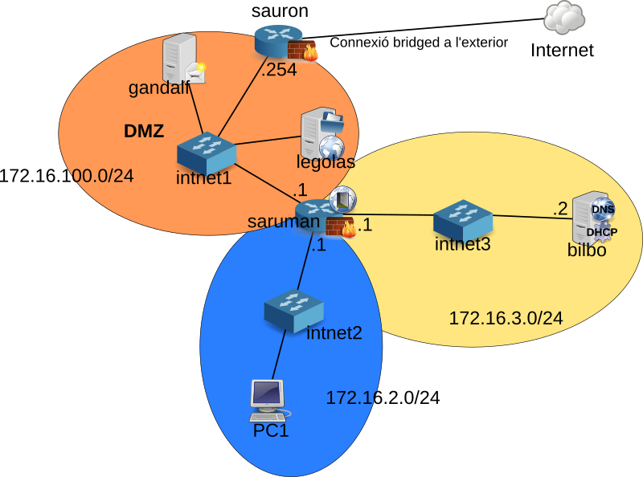

= Lab 1.1.0
Josep Queralt <jqueral8@xtec.cat>
:revdate: Febrer 26, 2016
:revnumber: 0.1
:doctype: article
:encoding: utf-8
:lang: ca
:toc: left
:toclevels: 3
:numbered:
:teacher:

ifdef::teacher[]
(Versió del professor)
endif::teacher[]

////
ifndef::teacher[]
.Entregar
====
*Resposta*
====
endif::teacher[]
ifdef::teacher[]
.Solució
====
*Solució*
====
endif::teacher[]
////

<<<

== Preparació de l'entorn de laboratori

<<<

=== Preparació de saruman

. Basat en Debian83 Console
. Canviar el nom
+
ifndef::teacher[]
.Entregar
====
*Resposta*
====
endif::teacher[]
ifdef::teacher[]
.Solució
====
[source,bash]
----
nano /etc/hostname
saruman
----
====
endif::teacher[]

. Afegir tres targetes de xarxa
.. VMnet19
.. VNet2
.. VNet3
. Configuració dels paràmetres de xarxa a */etc/network/interfaces*
+
ifndef::teacher[]
.Entregar
====
*Resposta*
====
endif::teacher[]
ifdef::teacher[]
.Solució
====
[source,bash]
----
ifdown --all
----

[source,bash]
----
# This file describes the network interfaces available on your system
# and how to activate them. For more information, see interfaces(5).

source /etc/network/interfaces.d/*

# The loopback network interface
auto lo
iface lo inet loopback

# The primary network interface
allow-hotplug eth0
auto eth0
iface eth0 inet static
address 172.16.100.1
netmask 255.255.255.0
gateway 172.16.100.254

allow-hotplug eth1
auto eth1
iface eth1 inet static
address 172.16.2.1
netamsk 255.255.255.0

allow-hotplug eth2
auto eth2
iface eth2 inet static
address 172.16.3.1
netmask 255.255.255.0
----

[source,bash]
----
ifup --all
----
====
endif::teacher[]

. Configuració dels DNS a */etc/resolv.conf*
+
ifndef::teacher[]
.Entregar
====
*Resposta*
====
endif::teacher[]
ifdef::teacher[]
.Solució
====
[source,bash]
----
domain localdomain
search localdomain
nameserver 8.8.8.8
nameserver 8.8.4.4
----
====
endif::teacher[]

. Cal convertir aquesta màquina en un router. Recordeu que normalment quan una màquina rep un paquet que no va dirigit a ella simplement s'elimina. Cal modificar aquest comportament de manera que els paquets rebuts i no dirigits a la pròpia màquina es reenviin en funció de les taules d'encaminament.
+
Habilitar aquest comportament rep el nom d'habilitar el *forwarding * de paquets.
+
Per fer-ho hi ha dues possibilitats, la primera és modificar el contingut del fitxer */proc/sys/net/ipv4/ip_forward* i posar un 1 enlloc d'un 0.
+
[source,bash]
----
echo 1 > /proc/sys/net/ipv4/ip_forward
----
+
Fer-ho d'aquesta manera *no fa permanent el canvi*, al reiniciar la màquina es restaura la configuració de forwarding a la opció que estigués per defecte.
+
Per fer en canvi permanent cal modificar el fitxer */etc/sysctl.conf*.
+
[source,bash]
----
#
# /etc/sysctl.conf - Configuration file for setting system variables
# See /etc/sysctl.d/ for additional system variables.
# See sysctl.conf (5) for information.
#

....

# Uncomment the next line to enable packet forwarding for IPv4
net.ipv4.ip_forward=1 # Habilitar aquesta línia
....
----

. Per verificar que el "forwarding" està configurat correctament.
+
[source,bash]
----
root@proxy~# man sysctl
root@proxy~# sysctl -a | grep ip_forward
net.ipv4.ip_forward = 1
----

. Finalment cal revisar la taula de rutes per assegurar que aquest node coneix totes les rutes necessaries pel seu funcionament.
+
ifndef::teacher[]
.Entregar
====
*Resposta*
====
endif::teacher[]
ifdef::teacher[]
.Solució
====
[source,bash]
----
root@saruman:~# route
Kernel IP routing table
Destination     Gateway         Genmask         Flags Metric Ref    Use Iface
default         172.16.100.254  0.0.0.0         UG    0      0        0 eth0
172.16.0.0      *               255.255.0.0     U     0      0        0 eth1
172.16.3.0      *               255.255.255.0   U     0      0        0 eth2
172.16.100.0    *               255.255.255.0   U     0      0        0 eth0

----
====
endif::teacher[]

. Afegir les rutes necessaries per al correcte funcionament del router.
+
Hi ha varies maneres d'afegir rutes a un sistema Debian. Es pot utilitzar les comandes *route* o *ip route*, en aquest cas les rutes *no* són permanents i caldrà afegir-les cada cop que arranqui el sistema.
+
La segona opció és utilitzar les comandes anteriors però dins del fitxer */etc/network/interfaces*. Doneu un cop d'ull a *man interfaces*, opcions pre-down i post-up.
+
ifndef::teacher[]
.Entregar
====
*Resposta*
====
endif::teacher[]
ifdef::teacher[]
.Solució
====
Les tres xarxes involucrades estan connectades directament al node, per tant no calen més rutes.
====
endif::teacher[]

=== Configuració de sauron

. Basat en Debian83 Console o en saruman
. Canviar el nom

[source,bash]
----
nano /etc/hostname
sauron
----

. Afegir dues targetes de xarxa
.. Bridged
.. VMNet19
. Configuració dels paràmetres de xarxa */etc/network/interfaces*
+
ifndef::teacher[]
.Entregar
====
*Resposta*
====
endif::teacher[]
ifdef::teacher[]
.Solució
====
[source,bash]
----
ifdown --all
----

[source,bash]
----
# This file describes the network interfaces available on your system
# and how to activate them. For more information, see interfaces(5).

source /etc/network/interfaces.d/*

# The loopback network interface
auto lo
iface lo inet loopback

# The primary network interface
allow-hotplug eth0
auto eth0
iface eth0 inet static
address 192.168.1.90
netmask 255.255.255.0
gateway 192.68.1.1

allow-hotplug eth1
auto eth1
iface eth1 inet static
address 172.16.100.254
netamask 255.255.255.0
----

[source,bash]
----
ifup --all
----
====
endif::teacher[]

. Configuració dels DNS a */etc/resolv.conf*
+
ifndef::teacher[]
.Entregar
====
*Resposta*
====
endif::teacher[]
ifdef::teacher[]
.Solució
====
[source,bash]
----
domain localdomain
search localdomain
nameserver 8.8.8.8
nameserver 8.8.4.4
----
====
endif::teacher[]

. Cal convertir aquesta màquina en un router. Recordeu que normalment quan una màquina rep un paquet que no va dirigit a ella simplement s'elimina. Cal modificar aquest comportament de manera que els paquets rebuts i no dirigits a la pròpia màquina es reenviin en funció de les taules d'encaminament.
+
Habilitar aquest comportament rep el nom d'habilitar el *forwarding * de paquets.
+
Per fer-ho hi ha dues possibilitats, la primera és modificar el contingut del fitxer */proc/sys/net/ipv4/ip_forward* i posar un 1 enlloc d'un 0.
+
[source,bash]
----
echo 1 > /proc/sys/net/ipv4/ip_forward
----
+
Fer-ho d'aquesta manera *no fa permanent el canvi*, al reiniciar la màquina es restaura la configuració de forwarding a la opció que estigués per defecte.
+
Per fer en canvi permanent cal modificar el fitxer */etc/sysctl.conf*.
+
[source,bash]
----
#
# /etc/sysctl.conf - Configuration file for setting system variables
# See /etc/sysctl.d/ for additional system variables.
# See sysctl.conf (5) for information.
#

....

# Uncomment the next line to enable packet forwarding for IPv4
net.ipv4.ip_forward=1 # Habilitar aquesta línia
....
----

. Per verificar que el "forwarding" està configurat correctament.
+
[source,bash]
----
root@proxy~# man sysctl
root@proxy~# sysctl -a | grep ip_forward
net.ipv4.ip_forward = 1
----

. Configurar el NAT
+
Per fer-ho utilitzarem el paquet *iptables* que proporciona característiques de firewall al node.

[source,bash]
----
# iptables-persistent guarda la configuració actual de iptables
apt-get install iptables-persistent
iptables -t nat -A POSTROUTING -o eth0 -j MASQUERADE
iptables -A FORWARD -i eth1 -j ACCEPT
# Recarreguem la configuració inicial de iptables-persistent
dpkg-reconfigure iptables-persistent
----

La configuració queda guardada a /etc/iptables/rules.v4

. Finalment cal revisar la taula de rutes per assegurar que aquest node coneix totes les rutes necessaries pel seu funcionament.
+
ifndef::teacher[]
.Entregar
====
*Resposta*
====
endif::teacher[]
ifdef::teacher[]
.Solució
====
[source,bash]
----
root@sauron:~# route
Kernel IP routing table
Destination     Gateway         Genmask         Flags Metric Ref    Use Iface
default         192.168.1.1     0.0.0.0         UG    0      0        0 eth0
172.16.100.0    *               255.255.255.0   U     0      0        0 eth1
192.168.1.0     *               255.255.255.0   U     0      0        0 eth0

----

Aquest router desconiex on són les xarxes 172.16.0.0/16, per tant caldrà afegir les rutes adequades per indicar-li el camí.
====
endif::teacher[]

. Afegir les rutes necessaries per al correcte funcionament del router.
+
Hi ha varies maneres d'afegir rutes a un sistema Debian. Es pot utilitzar les comandes *route* o *ip route*, en aquest cas les rutes *no* són permanents i caldrà afegir-les cada cop que arranqui el sistema.
+
La segona opció és utilitzar les comandes anteriors però dins del fitxer */etc/network/interfaces*. Doneu un cop d'ull a *man interfaces*, opcions pre-down i post-up.
+
ifndef::teacher[]
.Entregar
====
*Resposta*
====
endif::teacher[]
ifdef::teacher[]
.Solució
====
[source,bash]
----
# This file describes the network interfaces available on your system
# and how to activate them. For more information, see interfaces(5).

source /etc/network/interfaces.d/*

# The loopback network interface
auto lo
iface lo inet loopback

# The primary network interface
allow-hotplug eth0
auto eth0
iface eth0 inet static
address 192.168.1.90
netmask 255.255.255.0
gateway 192.68.1.1

allow-hotplug eth1
auto eth1
iface eth1 inet static
address 172.16.100.254
netmask 255.255.255.0
### Rutes estatiques ###
post-up route add -net 172.16.0.0 netmask 255.255.0.0 gw 172.16.100.1
pre-down route del -net 172.16.0.0 netmask 255.255.0.0 gw 172.16.100.1
----
====
endif::teacher[]

=== Preparació de les màquines virtuals servidor

En principi les màquines virtuals sobre les que s'instal·laran servidors haurien de ser màquines sense cap entorn gràfic instal·lat. No obstant per facilitar la feina d'administració i per permetre capturar pantalles es permetrà la instal·lació d'algun escriptori lleuger en aquestes màquines.

Es permet la instal·lació d'un dels següents escriptoris lleugers:

* XFCE
* LXDE
* Mate
* Cinnamon (Pot donar problemes amb les màquines virtuals)

[IMPORTANT]
====
No instal·leu un escriptori pesat a les màquines servidor. En particular *no* instal·leu:

* gnome3
* kde
====

==== Desinstal·lar el network manager

El network-manager és un component que permet gestionar les conexions de xarxa des d'un entorn gràfic. És incompatible amb la configuració mitjançant fitxers de text.

No es recomana el seu ús en les màquines que actuen com a servidor i per tant el desinstalarem.

Les màquines que actuen com a client si que poden tenir instal·la aquest component.

. Desinstal·lar el paquet network-manager i els seus fitxers de configuració.
+
ifndef::teacher[]
.Entregar
====
*Resposta*
====
endif::teacher[]
ifdef::teacher[]
.Solució
====
[source,bash]
----
apt-get purge network-manager
----
====
endif::teacher[]

. Configurar la xarxa manualment a */etc/network/interfaces*
+
ifndef::teacher[]
.Entregar
====
*Resposta*
====
endif::teacher[]
ifdef::teacher[]
.Solució
====
[source,bash]
----

----
====
endif::teacher[]

==== Verificar repositoris

Avans de començar a treballar cal:

. Verificar que els repositoris siguin els adequats
+
ifndef::teacher[]
.Entregar
====
*Resposta*
====
endif::teacher[]
ifdef::teacher[]
.Solució
====
[source,bash]
----
root@debian83:~# cat /etc/apt/sources.list
#

# deb cdrom:[Debian GNU/Linux 8.3.0 _Jessie_ - Official amd64 DVD Binary-1 20160123-19:03]/ jessie contrib main

# deb cdrom:[Debian GNU/Linux 8.3.0 _Jessie_ - Official amd64 DVD Binary-1 20160123-19:03]/ jessie contrib main

deb http://ftp.es.debian.org/debian/ jessie main
deb-src http://ftp.es.debian.org/debian/ jessie main

deb http://security.debian.org/ jessie/updates main contrib
deb-src http://security.debian.org/ jessie/updates main contrib

# jessie-updates, previously known as 'volatile'
deb http://ftp.es.debian.org/debian/ jessie-updates main contrib
deb-src http://ftp.es.debian.org/debian/ jessie-updates main contrib
root@debian83:~#
----
====
endif::teacher[]
. Actualitzar els indexos locals contra els repositoris escollits.
+
ifndef::teacher[]
.Entregar
====
*Resposta*
====
endif::teacher[]
ifdef::teacher[]
.Solució
====
[source,bash]
----
apt-get update
----
====
endif::teacher[]
. Actualitzar els paquets del sistema a les versions més actuals.
+
ifndef::teacher[]
.Entregar
====
*Resposta*
====
endif::teacher[]
ifdef::teacher[]
.Solució
====
[source,bash]
----
apt-get upgrade
----
====
endif::teacher[]

==== Instal·lar les vmware tools en debian

. Instal·lar prerequisits, gcc, make i les capçaleres del kernel utilitzat.
+
[source, bash]
----
apt-get install gcc
apt-get install make
----
. Buscar ajuda sobre la comanda *uname*
+
ifndef::teacher[]
.Entregar
====
*Resposta*
====
endif::teacher[]
ifdef::teacher[]
.Solució
====
[source,bash]
----
root@debian83:~# whatis uname
uname (2)            - obtiene el nombre e información del núcleo actual
uname (1)            - print system information
----
====
endif::teacher[]

. Averiguar quina és la versió de del kernel utilitzat.
+
ifndef::teacher[]
.Entregar
====
*Resposta*
====
endif::teacher[]
ifdef::teacher[]
.Solució
====
[source, bash]
----
uname-r
3.16.0-4-amd64
----
====
endif::teacher[]

. Buscar quines versions del paquet *linux-headers* estan disponibles als repositoris.
+
ifndef::teacher[]
.Entregar
====
*Resposta*
====
endif::teacher[]
ifdef::teacher[]
.Solució
====
[source, bash]
----
apt-cache search linux-headers
linux-headers-3.16.0-4-all - All header files for Linux 3.16 (meta-package)
linux-headers-3.16.0-4-all-amd64 - All header files for Linux 3.16 (meta-package)
linux-headers-3.16.0-4-amd64 - Header files for Linux 3.16.0-4-amd64
linux-headers-3.16.0-4-common - Common header files for Linux 3.16.0-4
linux-headers-amd64 - Header files for Linux amd64 configuration (meta-package)
----
====
endif::teacher[]

. Instal·lar la versiò de les capçaleres del kernel que estem utilitzant.
+
ifndef::teacher[]
.Entregar
====
*Resposta*
====
endif::teacher[]
ifdef::teacher[]
.Solució
====
[source, bash]
----
apt-get install linux-headers-3.16.0.4-amd64
----
====
endif::teacher[]
. Muntar la unitat virtual i descomprimir l'script d'instal·lació.
+
[source, bash]
----
mkdir /mnt/cdrom
mount /dev/sr0 /mnt/cdrom # /dev/sr0 és el primer cdrom scsi

# Podriem verificar el punt de muntatge amb
ls -al /mnt/cdrom

cd ~
# x -> extract
# v -> verbose
# z -> gzip
tar -xvzf /mnt/cdrom/VMWareTools-9.9.4-31938940.tar.gz

./vmware-install.pl
----

==== Instal·lar les vmware tools en CentOS7

. Instal·lar prerequisits, gcc, make i les capçaleres del kernel utilitzat.
+
[source, bash]
----
yum install gcc

yum autoremove opem-vm-tools

[root@CentOS7 kernels]# uname -r
3.10.0-327.el7.x86_64

yum install kernel-devel-3.10.0-327.el7.x86_64

----

. Muntar la unitat virtual i descomprimir l'script d'instal·lació
+
[source, bash]
----
TODO
----

==== Deshabilitar el "beep" de la bios

Afegir *mks.noBeep = "TRUE"* al fitxer .vmx de la màquina virtual.

==== Compartir una carpeta amb el host

. Crear una carpeta shared al host.
. Habilitar les carpetes compartides a la màquina virtual, Virtual Machine Settings/Options/Shared folders i posar-li un nom, shared, per exemple.
. La carpeta compartida es troba a */mnt/hgfs/shared*

==== Eines de monitoratge de xarxa

* També pot ser útil instal·lar alguna eina de monitoratge de xarxa, per exemple el *WireShark* en el cas que disposeu d'entorn gràfic o *tcpdump* en cas contrari.
+
[source,bash]
----
apt-get install wireshark

# o bé

apt-get install tcpdump
----

==== Prompt i  usuaris

[IMPORTANT]
====
A cadascuna de les màquines virtuals heu de crear un usuari amb l'estructura *CognomInicialNom*, per exemple en Toni Lòpez crearà un usuari anomenat lopezt, tot en minúscula i sense accents ni lletres no angleses.

AQUEST USUARI SERÀ UTILITZAT OBLIGATORIAMENT A TOTES LES PRÀCTIQUES, NO UTILITZEU L'USUARI ROOT.
====

* Verifiqueu que el vostre usuari té permís de sudo a totes les màquines.
+
[source,bash]
----
# En cas que el vostre usuari no pugui fer sudo:
# Verificar que la comanda sudo està instalada
dpkg -L sudo
# Per obrir el fitxer de configuració de sudoers
visudo
# Afegir a l'apartat # User privilege specificaction
lopezt	ALL=(ALL:ALL) ALL
----
+
[IMPORTANT]
====
Cal que configureu el vostre terminal perquè al prompt aparegui el vostre nom i la data ressaltat en diferents colors. *Això és imprescindible per avaluar les captures*.
====
+
[source,bash]
----
# Cal obrir el fitxer .bashrc situat a la home del vostre usuari, aquest fitxer conté la configuració del terminal.
# Cal buscar la línia que conté
force_color_prompt=yes
# i descomentar-la
# Busqueu el següent fragment i canvieu la part resaltada:

if [ "$color_prompt" = yes ]; then
    PS1='[\d \t \u@\h:\w] $'
else
    PS1='${debian_chroot:+($debian_chroot)}\u@\h:\w\$ '
fi
----
+
A partir d'ara el prompt de la màquina Linux hauria de ser com el de la imatge, llevat del nom de màquina:
+
[source,bash]
----
[mar mar 01 12:31:06 queraltj@bilbo:~] $
----
